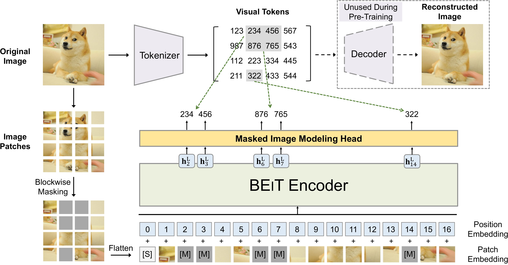

# XREPORT: Radiological Reports Generation

## 1. Project Overview
XRAY Report Generator is a machine learning-based tool designed to assist radiologists in generating descriptive reports from X-ray images. This project aims to reduce the time and effort required by radiologists to write detailed reports based on the XRAY scan description, thereby increasing efficiency and turnover. The generative model is trained using combinations of XRAY images and their labels (descriptions), in the same fashion as image captioning models learn a sequence of word tokens associated to specific parts of the image. While originally developed around the MIMIC-CXR Database (https://www.kaggle.com/datasets/wasifnafee/mimic-cxr), this project can be applied to any dataset with X-ray scans labeled with their respective radiological reports (or any kind of description). The XREPORT Deep Learning (DL) model developed for this scope makes use of a transformer encoder-decoder architecture, which relies on both self attention and cross attention to improve text significance within the clinical image context. The images features are extracted using a custom convolutional encoder with pooling layers to reduce dimensionality. Once a pretrained model is obtained leveraging a large number of X-RAY scans and their descriptions, the model can be used in inference mode to generate radiological reports from the raw pictures. 

## 2. XREPORT model
The XREPORT model leverages a robust transformer encoder-decoder architecture to generate detailed radiology reports from X-ray images. It begins by extracting rich image features using a state-of-the-art, pretrained image encoder (*beit-base-patch16-224*) that is integrated into the captioner model. This vision transformer model utilizes the BEiT architecture, which is designed to pre-train image transformers in a manner analogous to BERT in natural language processing, enabling efficient feature extraction from images for various vision tasks.

Architecture of BeiT models

Subsequently, the stacked transformer encoders, each equipped with multi-head self-attention and feedforward networks, further process these refined image vectors. These encoders produce high-level feature representations that capture the essential characteristics of the scans. The transformer decoder then employs a cross-attention mechanism to align the image features with specific words during report generation. To maintain coherence and context throughout the generated report, the model utilizes causal masking in its auto-regressive decoding process, ensuring that each token is generated with full consideration of the preceding context.

General transformer model architecture

**Parametric tokenization:** to improve the vectorization and semantic representation of the training text corpus, this framework now supports multiple pretrained tokenizers from the Hugging Face library. By default, we use the distilbert/distilbert-base-uncased tokenizer, but the system can be configured to use a variety of models, such as BERT (bert-base-uncased), RoBERTa (roberta-base), GPT-2 (gpt2), and more, depending on the user’s choice. 

The tokenizer model is automatically downloaded and cached in *resources/models/tokenizers* on the first run, with the weights being reused for future training sessions. For word embedding, the XREPORT model uses positional embeddings, allowing it to encode the relative positions of tokens within sequences. Additionally, the model supports masking for variable-length sequences, ensuring adaptability to text inputs of different lengths. This flexibility allows seamless processing of diverse textual data while maintaining accurate and meaningful representations.

## 3. Installation
The installation process on Windows has been designed to be fully automated. To begin, simply run *start_on_windows.bat.* On its first execution, the installation procedure will execute with minimal user input required. The script will check if either Anaconda or Miniconda is installed and can be accessed from your system path. If neither is found, it will automatically download and install the latest Miniconda release from https://docs.anaconda.com/miniconda/. Following this step, the script will proceed with the installation of all necessary Python dependencies. This includes Keras 3 (with PyTorch support as the backend) and the required CUDA dependencies (CUDA 12.4) to enable GPU acceleration. Should you prefer to handle the installation process separately, you can run the standalone installer by running *setup/install_on_windows.bat*.

**Important:** After installation, if the project folder is moved or its path is changed, the application will no longer function correctly. To fix this, you can either:

- Open the main menu, select *Setup and maintentance* and choose *Install project in editable mode*
- Manually run the following commands in the terminal, ensuring the project folder is set as the current working directory (CWD):

    `conda activate XREPORT`

    `pip install -e . --use-pep517` 

### 3.1 Just-In-Time (JIT) Compiler
This project leverages Just-In-Time model compilation through `torch.compile`, enhancing model performance by tracing the computation graph and applying advanced optimizations like kernel fusion and graph lowering. This approach significantly reduces computation time during both training and inference. The default backend, TorchInductor, is designed to maximize performance on both CPUs and GPUs. Additionally, the installation includes Triton, which generates highly optimized GPU kernels for even faster computation on NVIDIA hardware. For Windows users, a precompiled Triton wheel is bundled with the installation, ensuring seamless integration and performance improvements.

## 4. How to use
On Windows, run *start_on_windows.bat* to launch the main navigation menu and browse through the various options. Please note that some antivirus software, such as Avast, may flag or quarantine python.exe when called by the .bat file. If you encounter unusual behavior, consider adding an exception for your Anaconda or Miniconda environments in your antivirus settings.

### 4.1 Navigation menu

**1) Data analysis:** analyze and validate the image dataset using different metrics. Images statistics such as mean pixel values, standard deviation and noise ratio are reported in a detailed summary within the validation database (*resources/validation/dataset/dataset_validation.csv*. The average pixel distribution of the dataset is reported in *resources/validation/figures*.  

**2) Build ML dataset:** Prepare the reports dataset for machine learning by processing and tokenizing X-ray descriptions and retrieving the associated image paths. Only one instance of the processed dataset is allowed at a time, and all training will be conducted using this data along with the corresponding processing metadata.

**3) Model training and evaluation:** open the machine learning menu to explore various options for model training and validation. Once the menu is open, you will see different options:

- **train from scratch:** start training an instance of the XREPORT model from scratch on the processed data.

- **train from checkpoint:** resume training from a pretrained checkpoint for an additional amount of epochs, using pretrained model settings and data.  

- **model evaluation:** evaluate the performance of pretrained model checkpoints using different metrics. The average mean squared error and mean average error are calculated for both the training and validation datasets. Random images are sampled from both datasets and used to generate reports that are then compared to their textual ground truth (real reports) using a series of metrics. 

**4) Generate radiological reports:** use the pretrained transformer decoder from a model checkpoint to generate radiological reports from input images. 

**5) Setup and Maintenance:** execute optional commands such as *Install project into environment* to reinstall the project within your environment, *update project* to pull the last updates from github, and *remove logs* to remove all logs saved in *resources/logs*. 

**6) Exit:** close the program immediately

### 4.2 Resources
This folder organizes data and results across various stages of the project, such as data validation, model training, and evaluation. By default, all data is stored within an SQLite database, which will automatically fetch input data from *database/dataset/XREPORT_dataset.csv*. To visualize and interact with the SQLite database, we recommend downloading and installing the DB Browser for SQLite, available at: https://sqlitebrowser.org/dl/.

The directory structure includes the following folders:

- **checkpoints:**  pretrained model checkpoints are stored here, and can be used either for resuming training or performing inference with an already trained model.

- **database:** the data source must be provided in *database/dataset/XREPORT_dataset.csv*, formatted according to the specified template (column *id* containing the image filenames and column *text* providing the corresponding description for each image). Processed data and validation results will be stored centrally within the main database *XREPORT_database.db*. All associated metadata will be promptly stored in *database/metadata*. For image training data, ensure all image files are placed in *database/images*, adhering to specified formats (.jpeg or .png). Graphical validation outputs will be saved separately within *database/validation*.

- **inference:** contains *images* where you place images intended for inference using the pretrained XREPORT model, and *reports*. The generated radiological reports from input images are saved within this latter folder. 

- **logs:** log files are saved here

- **templates:** reference template files can be found here

## 5. Configurations
For customization, you can modify the main configuration parameters using *settings/configurations.json*. 

#### General Configuration

| Parameter          | Description                                              |
|--------------------|----------------------------------------------------------|
| SEED               | Global seed for all numerical operations                 |

### Dataset Configuration

| Parameter          | Description                                              |
|--------------------|----------------------------------------------------------|
| SAMPLE_SIZE        | Number of samples to use from the dataset                |
| VALIDATION_SIZE    | Proportion of the dataset to use for validation          |
| IMG_AUGMENTATION   | Whether to apply data augmentation to images             |
| MAX_REPORT_SIZE    | Max length of text report (in tokens)                    |
| SPLIT_SEED         | Seed for random splitting of the dataset                 |
| TOKENIZER          | Tokenizer string (or name if among preselected)          |

### Model Configuration

| Parameter          | Description                                              |
|--------------------|----------------------------------------------------------|
| ATTENTION_HEADS    | Number of attention heads                                | 
| NUM_ENCODERS       | Number of encoder layers                                 |
| NUM_DECODERS       | Number of decoder layers                                 |
| EMBEDDING_DIMS     | Embedding dimensions (valid for both models)             | 
| FREEZE_IMG_ENCODER | Freeze the image encoder weights during training         |   
| JIT_COMPILE        | Apply Just-In_time (JIT) compiler for model optimization |
| JIT_BACKEND        | Just-In_time (JIT) backend                               |

#### Device Configuration

| Parameter          | Description                                              |
|--------------------|----------------------------------------------------------|
| DEVICE             | Device to use for training (e.g., GPU)                   |
| DEVICE ID          | ID of the device (only used if GPU is selected)          |
| MIXED_PRECISION    | Whether to use mixed precision training                  |
| NUM_PROCESSORS     | Number of processors to use for data loading             |

#### Training Configuration

| Parameter          | Description                                              |
|--------------------|----------------------------------------------------------|
| EPOCHS             | Number of epochs to train the model                      |
| ADDITIONAL EPOCHS  | Number of epochs to train the model from checkpoint      |
| BATCH_SIZE         | Number of samples per batch                              |
| TEMPERATURE        | Affects smoothness of softmax diistribution              |
| USE_TENSORBOARD    | Whether to use TensorBoard for logging                   |
| SAVE_CHECKPOINTS   | Save checkpoints during training (at each epoch)         |

#### LR Scheduler Configuration

| Parameter          | Description                                              |
|--------------------|----------------------------------------------------------|
| POST_WARMUP_LR     | Learning rate value after initial warmup                 |
| WARMUP_STEPS       | Number of warmup epochs                                  |

### Evaluation Configuration

| Parameter          | Description                                              |
|--------------------|----------------------------------------------------------|
| BATCH_SIZE         | Number of samples per batch during evaluation            | 
| SAMPLE_SIZE        | Number of samples from the dataset (evaluation only)     |
| VALIDATION_SIZE    | Fraction of validation data (evaluation only)            |

### Evaluation Configuration

| Parameter          | Description                                              |
|--------------------|----------------------------------------------------------|
| BATCH_SIZE         | Number of samples per batch during evaluation            | 
| SAMPLE_SIZE        | Number of samples from the dataset (evaluation only)     |
| VALIDATION_SIZE    | Fraction of validation data (evaluation only)            |

**Environmental variables** are stored in *setup/variables/.env*. For security reasons, this file is typically not uploaded to GitHub. Instead, you must create this file manually by copying the template from *resources/templates/.env* and placing it in the *setup/variables* directory.

| Variable              | Description                                              |
|-----------------------|----------------------------------------------------------|
| KERAS_BACKEND         | Sets the backend for Keras, default is PyTorch           |
| TF_CPP_MIN_LOG_LEVEL  | TensorFlow logging verbosity                             |

## 6. License
This project is licensed under the terms of the MIT license. See the LICENSE file for details.

