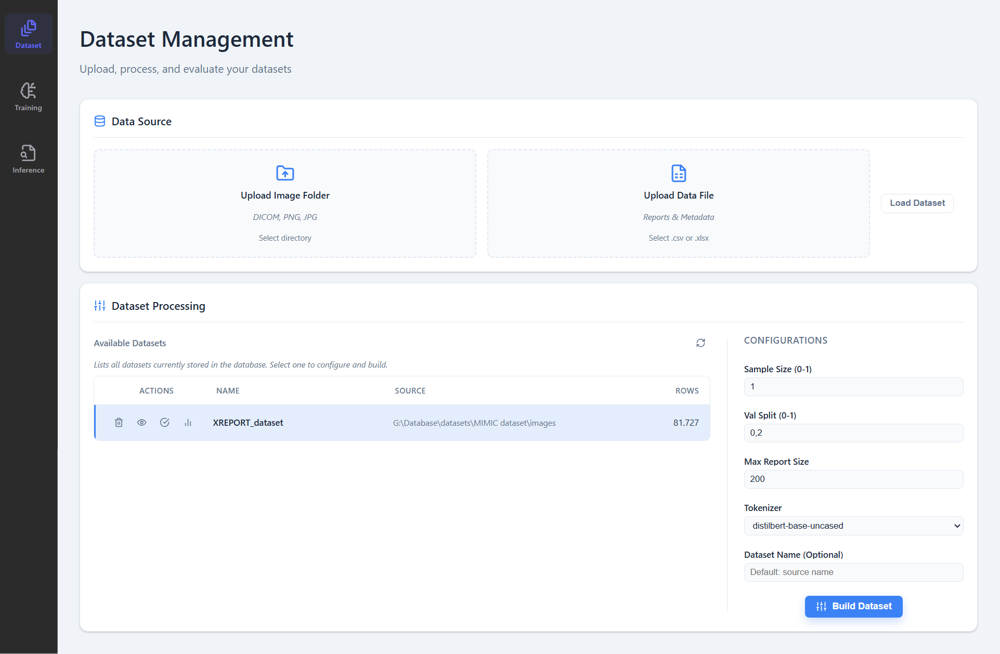
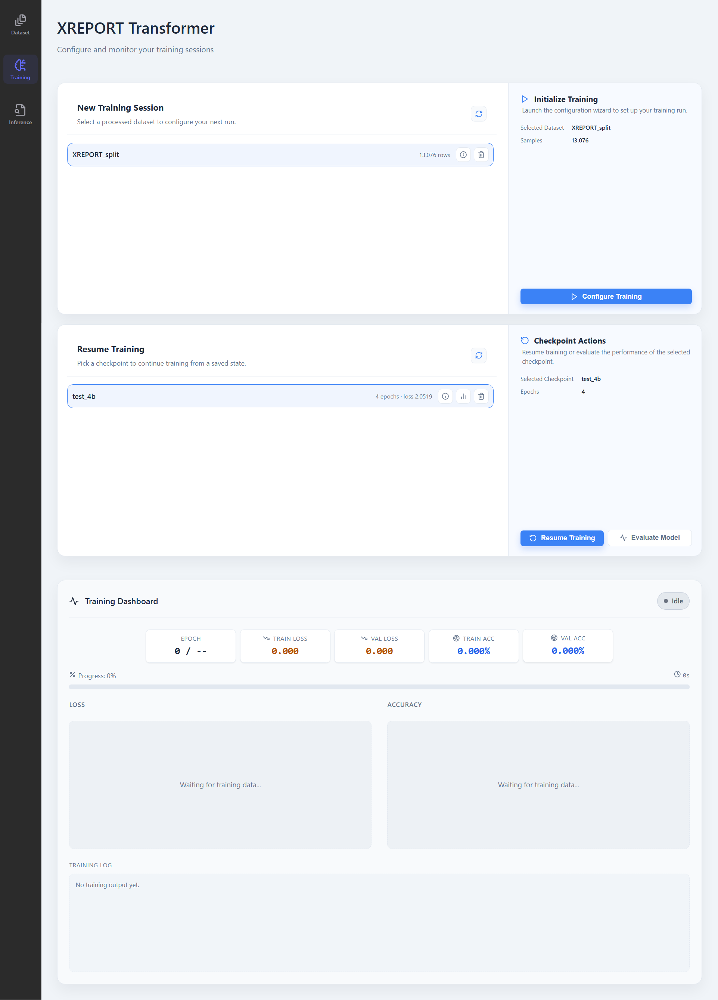
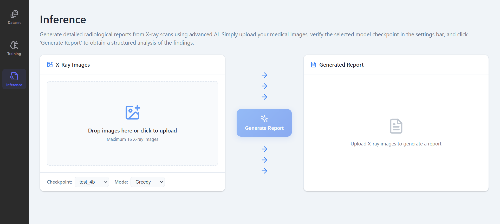
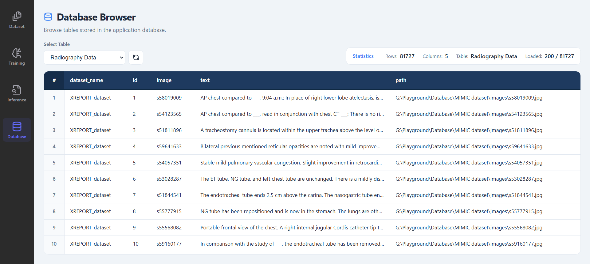

# XREPORT Radiological Reports Generator

## 1. Project Overview

XREPORT is a client-server application designed to generate draft radiological reports from X-ray images. It leverages a vision-language machine learning workflow to interpret visual data and produce consistent, text-based diagnostic descriptions.

The system is architected as:
- **Backend**: A FastAPI service managing data processing, model training, and inference logic.
- **Frontend**: A comprehensive web UI for configuring datasets, monitoring training progress in real-time, and reviewing generated reports.

This tool aims to accelerate the reporting workflow for radiologists by providing high-quality, editable drafts.

> **Work in Progress**: This project is under active development. Features and layouts may evolve.

---

## 2. Model and Dataset (Optional)

XREPORT employs an image captioning model trained via supervised learning. It learns mappings between visual pathologies in X-ray images and their corresponding textual descriptors in radiology reports.

The system is designed to work with:
- **MIMIC-CXR**: Initially validated on this public dataset.
- **Custom Datasets**: User-provided datasets that follow the supported image-text pairing structure.

---

## 3. Installation

### 3.1 Windows (One Click Setup)

The project includes an automated setup script for Windows: `XREPORT/start_on_windows.bat`.

The launcher performs the following:
1. Downloads portable runtimes (Python, Node.js) to `XREPORT/resources/runtimes`.
2. Installs all backend and frontend dependencies (including `uv` and `npm` packages).
3. Builds the frontend client for local serving.
4. Launches the backend server and opens the web interface.

**Note**: The first run will take time to download runtimes and compile dependencies. Subsequent runs check for updates and launch immediately. This setup is portable and does not modify your system registry.

### 3.2 macOS / Linux (Manual Setup)

**Prerequisites**:
- Python 3.14.x
- Node.js 22.x + npm
- uv (recommended)

**Setup Steps**:

1. **Configure Environment**: Copy or edit `XREPORT/settings/.env` to match your local ports.
2. **Backend Setup**:
   ```bash
   uv sync
   # Optional: uv sync --all-extras for test dependencies
   ```
3. **Frontend Setup**:
   ```bash
   cd XREPORT/client
   npm install
   npm run build
   ```

---

## 4. How to Use

### 4.1 Windows

Launch the application by double-clicking `XREPORT/start_on_windows.bat`.

- **Web UI**: Opens automatically at `http://127.0.0.1:7861`.
- **Backend**: Runs on `http://127.0.0.1:8000`.

### 4.2 macOS / Linux

**Backend**:
```bash
uv run python -m uvicorn XREPORT.server.app:app --host 127.0.0.1 --port 8000
```

**Frontend** (Preview Mode):
```bash
cd XREPORT/client
npm run preview -- --host 127.0.0.1 --port 7861 --strictPort
```

### 4.3 Using the Application

The application workflow is divided into four main areas:

**Dataset Management**
The **Dataset** page allows you to prepare your data. It features a refined configuration panel for setting preprocessing parameters and an "Available Datasets" browser to view and select local datasets. Use this section to validate image-report pairs before training.



**Training Dashboard**
The **Training** page provides a real-time view of model performance. The dashboard layout features consolidated, single-row score panels for immediate visibility of key metrics (Loss, Reward). You can start, pause, and configure training runs, with live plotting synchronized to the backend.



**Validation & Inference**
The **Inference** page handles model evaluation. It includes a **Checkpoint Evaluation Wizard** with an optimized layout for assessing saved model checkpoints. Users can generate reports from new X-ray images and review the model's output quality.



**Database Browser**
The **Database** page lets you inspect stored history, including past training sessions and data uploads, providing full visibility into the system's state.



## 5. Setup and Maintenance

Use `XREPORT/setup_and_maintenance.bat` (Windows) to manage the installation.

Available actions:
- **Remove logs**: Clears the `XREPORT/resources/logs` directory.
- **Uninstall app**: Removes all portable runtimes, virtual environments (`.venv`), and build artifacts to clean the directory.
- **Initialize database**: Resets the local SQLite database used by the backend.

## 6. Resources

The `XREPORT/resources` directory contains project assets and artifacts:

- **checkpoints/**: Saved model weights and training states.
- **database/**: Contains the SQLite database file (`sqlite.db`) and local dataset storage.
- **logs/**: Backend and training logs.
- **models/**: Cached external model components (tokenizers, encoders).
- **runtimes/**: (Windows only) Portable Python and Node.js environments.
- **templates/**: Standard document templates for reports.


## 7. Configuration

Configurations are split between environment variables and JSON settings.

- **Environment**: Defined in `XREPORT/settings/.env`.
- **Backend/Training**: Defined in `XREPORT/settings/configurations.json`.

## 8. License

This project is licensed under the MIT License. See the `LICENSE` file for details.
