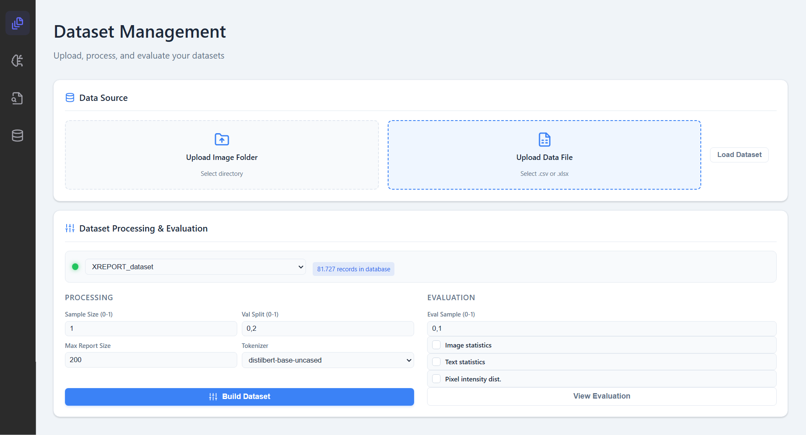
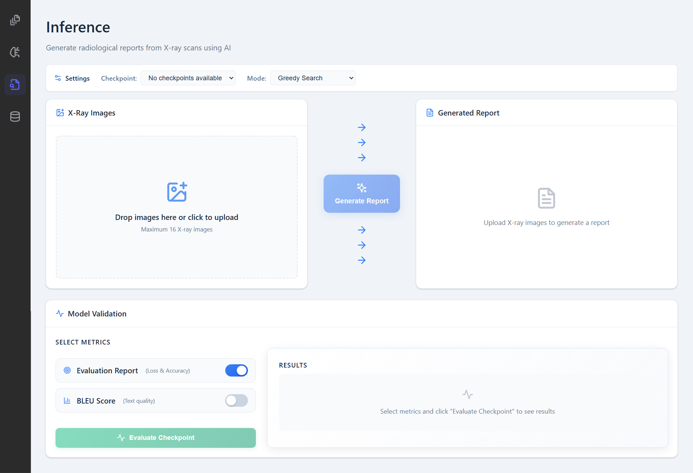
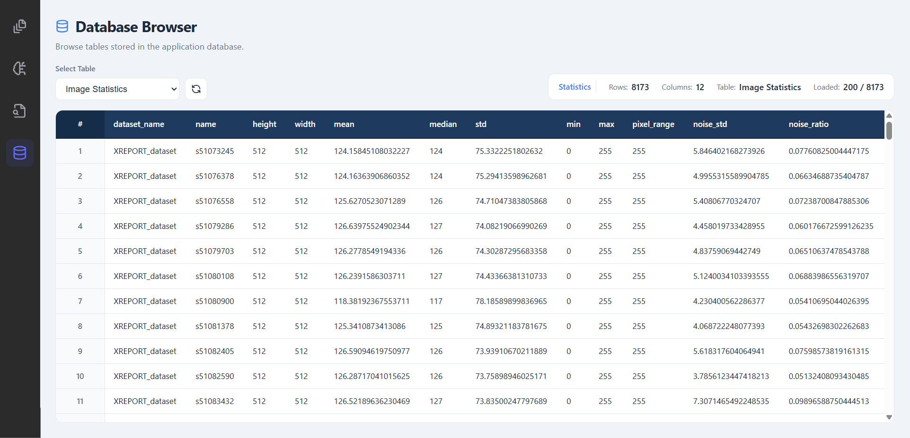

# XREPORT Radiological Reports Generator

## 1. Project Overview
XREPORT is a client-server application that generates draft radiology reports from X-ray images. It aims to reduce the time needed to produce consistent reports by using a machine learning image-to-text workflow. The system is organized as a backend service that manages data preparation, training, and inference, plus a web UI that lets users configure runs, monitor progress, and review outputs.

> **Work in Progress**: This project is still under active development. It will be updated regularly, but you may encounter bugs, issues, or incomplete features.

## 2. Model and Dataset (Optional)
XREPORT uses a vision-language image captioning model trained with supervised learning on paired X-ray images and report text. The project was initially validated against the public MIMIC-CXR dataset, but it can also work with user-provided datasets that follow the same image-report pairing pattern.

## 3. Installation

### 3.1 Windows (One Click Setup)
The Windows setup is fully automated via `XREPORT/start_on_windows.bat`. The launcher performs these actions in order:

1. Downloads portable runtimes for Python and Node.js into `XREPORT/resources/runtimes`.
2. Installs backend and frontend dependencies.
3. Builds the frontend for local preview.
4. Starts the backend and UI, then opens the browser.

First run behavior: it downloads runtimes and installs dependencies, so the first launch can take a few minutes. Subsequent runs reuse the local runtimes and only refresh dependencies when needed.

Portability and side effects: everything stays inside the project folder. No system-wide installs are performed.

### 3.2 macOS / Linux (Manual Setup)
Prerequisites:
- Python 3.13.x
- Node.js 22.x and npm
- uv (recommended for dependency management)

Setup steps:
1. Review and edit `XREPORT/settings/.env` to match your environment.
2. Backend setup (from the repository root):
   ```bash
   uv sync
   ```
3. Frontend setup:
   ```bash
   cd XREPORT/client
   npm install
   npm run build
   ```

Optional extras: run `uv sync --all-extras` if you want test dependencies.

## 4. How to Use

### 4.1 Windows
Double-click `XREPORT/start_on_windows.bat`. The UI opens at `http://127.0.0.1:7861` by default, and the backend listens on `http://127.0.0.1:8000`.

### 4.2 macOS / Linux
Backend:
```bash
uv run python -m uvicorn XREPORT.server.app:app --host 127.0.0.1 --port 8000
```

Frontend:
```bash
cd XREPORT/client
npm run preview -- --host 127.0.0.1 --port 7861 --strictPort
```

URLs:
- UI: `http://127.0.0.1:7861`
- Backend API: `http://127.0.0.1:8000`
- API docs: `http://127.0.0.1:8000/docs`

### 4.3 Using the Application

**Dataset**: Use the Dataset area to load and validate labeled image-report pairs, run preprocessing, and confirm the dataset is ready for training and inference.



**Training**: Configure a run, monitor loss/rewards, and resume from checkpoints.


**Inference**: Load a checkpoint and generate reports from X-ray scans.



**Database browser**: Use the database browser area to browse data saved into the database, such as previous training sessions, uploaded data, etc.



## 5. Setup and Maintenance
`XREPORT/setup_and_maintenance.bat` provides a small maintenance menu for Windows:

- Remove logs: deletes files from `XREPORT/resources/logs`.
- Uninstall app: removes portable runtimes, uv caches, `.venv`, and frontend build artifacts.
- Initialize database: creates or reinitializes the local database used by the backend.

## 6. Resources
`XREPORT/resources` stores runtime assets and generated artifacts so the project remains portable.

- checkpoints: saved model checkpoints and training artifacts created during training and evaluation.
- database: local datasets and the embedded SQLite database (`sqlite.db`) used by the backend.
- logs: application logs for troubleshooting.
- models: cached model artifacts such as encoders and tokenizers.
- runtimes: portable Python, uv, and Node.js installations used by the Windows launcher.
- templates: reserved for template files (the folder exists but is empty in this repo).

## 7. Configuration
Backend configuration lives in `XREPORT/settings/.env` (runtime variables) and `XREPORT/settings/server_configurations.json` (backend metadata, database defaults, and training defaults). Frontend build and preview settings live in `XREPORT/client/vite.config.ts`. The Windows launcher reads `XREPORT/settings/.env` to control UI host/port overrides.

| Variable | Description |
|----------|-------------|
| FASTAPI_HOST | Backend bind host; defined in `XREPORT/settings/.env`; default `127.0.0.1`. |
| FASTAPI_PORT | Backend port; defined in `XREPORT/settings/.env`; default `8000`. |
| UI_HOST | UI bind host; defined in `XREPORT/start_on_windows.bat` (override via `XREPORT/settings/.env`); default `127.0.0.1`. |
| UI_PORT | UI port; defined in `XREPORT/start_on_windows.bat` (override via `XREPORT/settings/.env`); default `7861`. |
| RELOAD | Backend autoreload toggle; defined in `XREPORT/start_on_windows.bat` (override via `XREPORT/settings/.env`); default `false`. |
| MPLBACKEND | Matplotlib backend for headless rendering; defined in `XREPORT/settings/.env`; default `Agg`. |
| KERAS_BACKEND | Keras runtime backend; defined in `XREPORT/settings/.env`; default `torch`. |
| TF_CPP_MIN_LOG_LEVEL | TensorFlow log verbosity; defined in `XREPORT/settings/.env`; default `1`. |

## 8. License
This project is licensed under the MIT License. See `LICENSE`.
