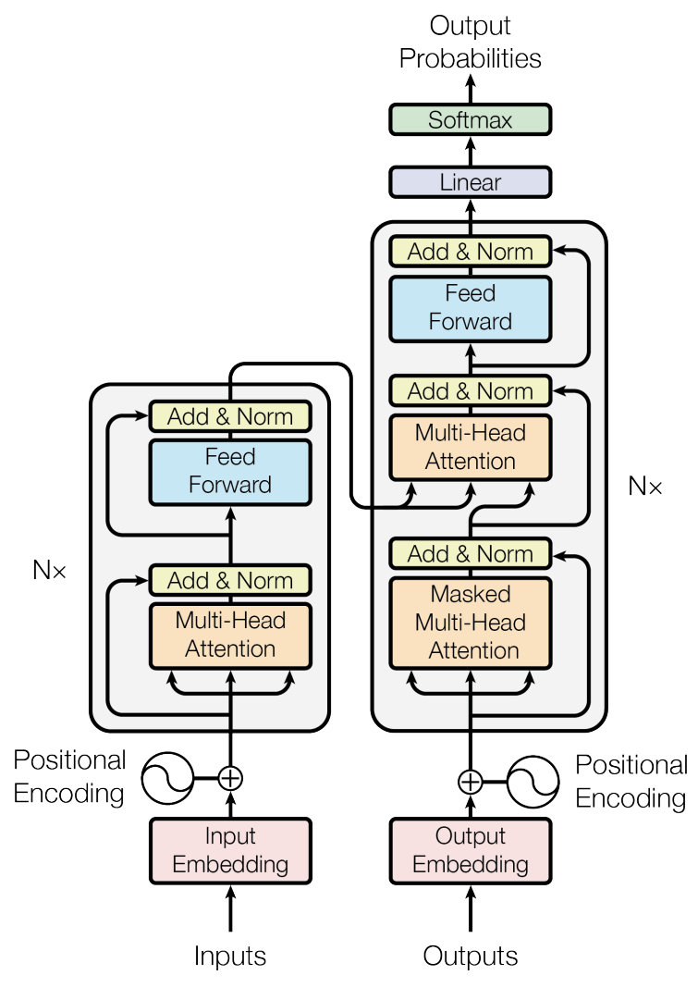

# XREPORT: Radiological Reports Generation

## 1. Project Overview
XRAY Report Generator is a machine learning-based tool designed to assist radiologists in generating descriptive reports from X-ray images. This project aims to reduce the time and effort required by radiologists to write detailed reports based on the XRAY scan description, thereby increasing efficiency and turnover. The generative model is trained using combinations of XRAY images and their labels (descriptions), in the same fashion as image captioning models learn a sequence of word tokens associated to specific parts of the image. While originally developed around the MIMIC-CXR Database (https://www.kaggle.com/datasets/wasifnafee/mimic-cxr), this project can be applied to any dataset with X-ray scans labeled with their respective radiological reports (or any kind of description). The XREPORT Deep Learning (DL) model developed for this scope makes use of a transformer encoder-decoder architecture, which relies on both self attention and cross attention to improve text significance within the clinical image context. The images features are extracted using a custom convolutional encoder with pooling layers to reduce dimensionality. Once a pretrained model is obtained leveraging a large number of X-RAY scans and their descriptions, the model can be used in inference mode to generate radiological reports from the raw pictures. 

## 2. XREPORT model
The XREPORT model is based on a transformer encoder-decoder architecture. Three stacked encoders with multi-head self-attention and feedforward networks are used downstream to the convolutional image encoder network to generate vectors with extracted x-ray scan features. The X-RAY scans are processed and reduced in dimensionality using a series of convolutional layers followed by max-pooling operations. These image vectors are then fed into the transformer decoder, which applies cross-attention between encoder and decoder inputs, to determine most important features in the images associated with specific words in the text. To ensure coherent report generation, the model employs causal masking on token sequences during decoding. This auto-regressive mechanism guarantees that generated reports consider the context of previously generated tokens.

General transformer model architecture

**Parametric tokenization:** to improve the vectorization and semantic representation of the training text corpus, this framework now supports multiple pretrained tokenizers from the Hugging Face library. By default, we use the distilbert/distilbert-base-uncased tokenizer, but the system can be configured to use a variety of models, such as BERT (bert-base-uncased), RoBERTa (roberta-base), GPT-2 (gpt2), and more, depending on the user’s choice.

The selected tokenizer splits the input text into subword units (tokens) and transforms these into vectors. The tokenizer model is automatically downloaded and cached in the training/TOKENIZERS directory on the first run, with the weights being reused for future training sessions. For word embedding, the XREPORT model couples token embeddings with positional embeddings, allowing it to encode the relative positions of tokens within sequences. Additionally, the model supports masking for variable-length sequences, ensuring adaptability to text inputs of different lengths. This flexibility allows seamless processing of diverse textual data while maintaining accurate and meaningful representations.

## 3. Installation
The installation process on Windows has been designed for simplicity and ease of use. To begin, simply run *start_on_windows.bat.* On its first execution, the installation procedure will automatically start with minimal user input required. The script will check if either Anaconda or Miniconda is installed on your system. If neither is found, it will automatically download and install the latest Miniconda release from https://docs.anaconda.com/miniconda/. After setting up Anaconda/Miniconda, the installation script will proceed with the installation of all necessary Python dependencies. This includes Keras 3 (with PyTorch support as the backend) and the required CUDA dependencies (CUDA 12.1) to enable GPU acceleration. If you'd prefer to handle the installation process separately, you can run the standalone installer by executing *setup/install_on_windows.bat*.

**Important:** After installation, if the project folder is moved or its path is changed, the application will no longer function correctly. To fix this, you can either:

- Open the main menu, select *Setup and maintentance* and choose *Install project in editable mode*
- Manually run the following commands in the terminal, ensuring the project folder is set as the current working directory (CWD):

    `conda activate XREPORT`

    `pip install -e . --use-pep517` 

### 3.1 Just-In-Time (JIT) Compiler
This project leverages Just-In-Time model compilation through `torch.compile`, enhancing model performance by tracing the computation graph and applying advanced optimizations like kernel fusion and graph lowering. This approach significantly reduces computation time during both training and inference. The default backend, TorchInductor, is designed to maximize performance on both CPUs and GPUs. Additionally, the installation includes Triton, which generates highly optimized GPU kernels for even faster computation on NVIDIA hardware. For Windows users, a precompiled Triton wheel is bundled with the installation, ensuring seamless integration and performance improvements.

## 4. How to use
On Windows, run *start_on_windows.bat* to launch the main navigation menu and browse through the various options. Alternatively, each file can be executed individually by running *python path/filename.py* for Python scripts or *jupyter notebook path/notebook.ipynb* for Jupyter notebooks. Please note that some antivirus software, such as Avast, may flag or quarantine python.exe when called by the .bat file. If you encounter unusual behavior, consider adding an exception for your Anaconda or Miniconda environments in your antivirus settings.

### 4.1 Navigation menu

**1) Data analysis:** runs *validation/data_validation.ipynb* to perform data validation using a series of metrics for the analysis of the dataset. 

**2) Data preprocessing:** prepare data from machine learning, starting from raw radiological images and their report in text format. This is done by running *preprocessing/data_preprocessing.py*

**3) Model training and evaluation:** open the machine learning menu to explore various options for model training and validation. Once the menu is open, you will see different options:
- **train from scratch:** runs *training/model_training.py* to start training an instance of the XREPORT model from scratch using the available data and parameters. 
- **train from checkpoint:** runs *training/train_from_checkpoint.py* to start training a pretrained XREPORT checkpoint for an additional amount of epochs, using pretrained model settings and data.  
- **model evaluation:** runs *validation/model_evaluation.ipynb* to evaluate the performance of pretrained model checkpoints using different metrics. 

**4) Generate radiological reports:** use the pretrained transformer decoder from a model checkpoint to generate radiological reports starting from an input image. This option executes *inference/report_generator.py*.

**5) Setup and Maintenance:** execute optional commands such as *Install project into environment* to run the developer model project installation, and **remove logs** to remove all logs saved in *resources/logs*.

**6) Exit:** close the program immediately

### 4.2 Resources
This folder is used to organize data and results for various stages of the project, including data validation, model training, and evaluation. Here are the key subfolders:

- **checkpoints:**  pretrained model checkpoints are stored here, and can be used either for resuming training or performing inference with an already trained model.

- **dataset:** contains images used to train the XREPORT model (*dataset/images*), as well as the file *XREPORT_dataset.csv* that should be provided for training purposes. This .csv file must contain two columns: *id* where the image names are given, and *text* where the associated text is saved. 

- **generation:** contains *images* where you place images intended for inference using the pretrained XREPORT model, and *reports*. The generated radiological reports from input images are saved within this latter folder. 

- **logs:** the application logs are saved within this folder

- **validation:** Used to save the results of data validation processes. This helps in keeping track of validation metrics and logs.

## 5. Configurations
For customization, you can modify the main configuration parameters using *settings/configurations.json*. 

#### General Configuration

| Parameter          | Description                                              |
|--------------------|----------------------------------------------------------|
| SEED               | Global seed for all numerical operations                 |

### Dataset Configuration

| Parameter          | Description                                              |
|--------------------|----------------------------------------------------------|
| SAMPLE_SIZE        | Number of samples to use from the dataset                |
| VALIDATION_SIZE    | Proportion of the dataset to use for validation          |
| IMG_NORMALIZE      | Whether to normalize image data                          |
| IMG_AUGMENT        | Whether to apply data augmentation to images             |
| MAX_REPORT_SIZE    | Max length of text report                                |
| TOKENIZER          | Tokenizer string (or name if among preselected)          |
| SPLIT_SEED         | Seed for random splitting of the dataset                 |

### Model Configuration

| Parameter          | Description                                              |
|--------------------|----------------------------------------------------------|
| IMG_SHAPE          | Shape of the input images (height, width, channels)      |
| EMBEDDING_DIMS     | Embedding dimensions (valid for both models)             |  
| NUM_HEADS          | Number of attention heads                                | 
| NUM_ENCODERS       | Number of encoder layers                                 |
| NUM_DECODERS       | Number of decoder layers                                 |
| JIT_COMPILE        | Apply Just-In_time (JIT) compiler for model optimization |
| JIT_BACKEND        | Just-In_time (JIT) backend                               |

#### Device Configuration

| Parameter          | Description                                              |
|--------------------|----------------------------------------------------------|
| DEVICE             | Device to use for training (e.g., GPU)                   |
| DEVICE ID          | ID of the device (only used if GPU is selected)          |
| MIXED_PRECISION    | Whether to use mixed precision training                  |
| NUM_PROCESSORS     | Number of processors to use for data loading             |

#### Training Configuration

| Parameter          | Description                                              |
|--------------------|----------------------------------------------------------|
| EPOCHS             | Number of epochs to train the model                      |
| ADDITIONAL EPOCHS  | Number of epochs to train the model from checkpoint      |
| LEARNING_RATE      | Learning rate for the optimizer                          |
| BATCH_SIZE         | Number of samples per batch                              |
| USE_TENSORBOARD    | Whether to use TensorBoard for logging                   |
| SAVE_CHECKPOINTS   | Save checkpoints during training (at each epoch)         |

### Evaluation Configuration

| Parameter          | Description                                              |
|--------------------|----------------------------------------------------------|
| BATCH_SIZE         | Number of samples per batch during evaluation            | 
| SAMPLE_SIZE        | Number of samples from the dataset (evaluation only)     |
| VALIDATION_SIZE    | Fraction of validation data (evaluation only)            |

## 6. License
This project is licensed under the terms of the MIT license. See the LICENSE file for details.

