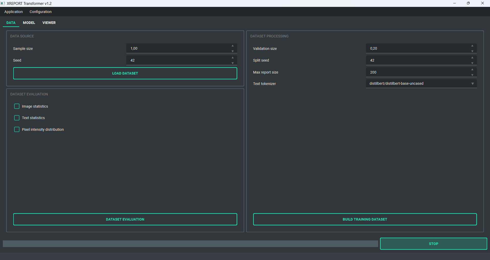
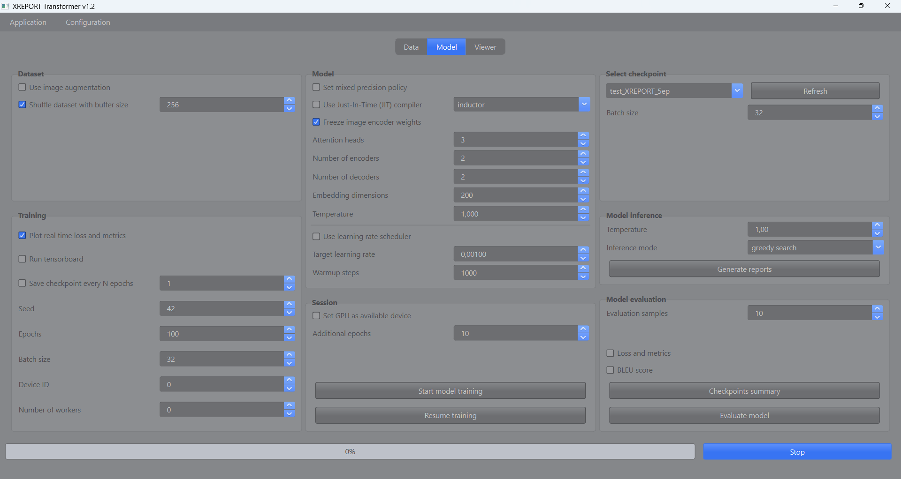
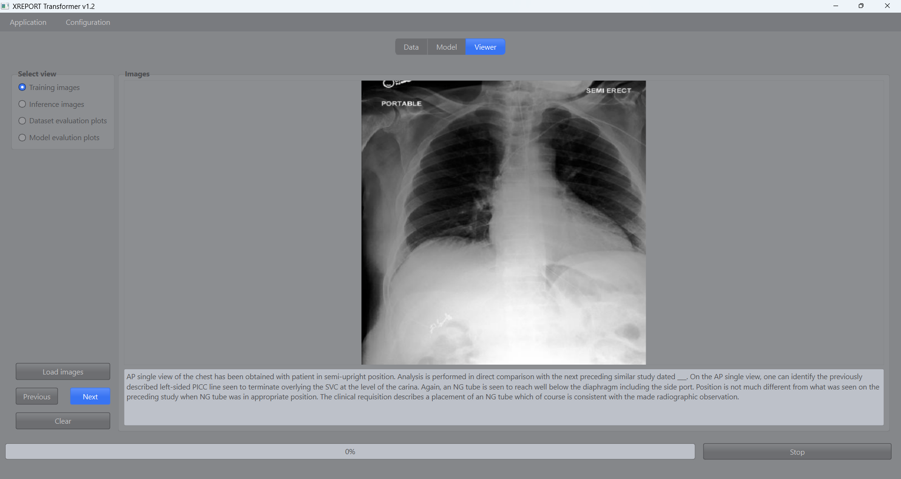

# XREPORT: Radiological Reports Generation

## 1. Project Overview
XRAY Report Generator is a machine learning-based tool designed to assist radiologists in generating descriptive reports from X-ray images. This project aims to reduce the time and effort required by radiologists to write detailed reports based on the XRAY scan description, thereby increasing efficiency and turnover. The generative model is trained using combinations of XRAY images and their labels (descriptions), in the same fashion as image captioning models learn a sequence of word tokens associated to specific parts of the image. While originally developed around the MIMIC-CXR Database (https://www.kaggle.com/datasets/wasifnafee/mimic-cxr), this project can be applied to any dataset with X-ray scans labeled with their respective radiological reports (or any kind of description). The XREPORT Deep Learning (DL) model developed for this scope makes use of a transformer encoder-decoder architecture, which relies on both self attention and cross attention to improve text significance within the clinical image context. The images features are extracted using a custom convolutional encoder with pooling layers to reduce dimensionality. Once a pretrained model is obtained leveraging a large number of X-RAY scans and their descriptions, the model can be used in inference mode to generate radiological reports from the raw pictures. 

## 2. XREPORT model
The XREPORT model leverages a robust transformer encoder-decoder architecture to generate detailed radiology reports from X-ray images. It begins by extracting rich image features using a state-of-the-art, pretrained image encoder (*beit-base-patch16-224*) that is integrated into the captioner model. This vision transformer model utilizes the BEiT architecture, which is designed to pre-train image transformers in a manner analogous to BERT in natural language processing, enabling efficient feature extraction from images for various vision tasks.

Architecture of BeiT models

Subsequently, the stacked transformer encoders, each equipped with multi-head self-attention and feedforward networks, further process these refined image vectors. These encoders produce high-level feature representations that capture the essential characteristics of the scans. The transformer decoder then employs a cross-attention mechanism to align the image features with specific words during report generation. To maintain coherence and context throughout the generated report, the model utilizes causal masking in its auto-regressive decoding process, ensuring that each token is generated with full consideration of the preceding context.

General transformer model architecture

**Parametric tokenization:** to improve the vectorization and semantic representation of the training text corpus, this framework now supports multiple pretrained tokenizers from the Hugging Face library. By default, we use the distilbert/distilbert-base-uncased tokenizer, but the system can be configured to use a variety of models, such as BERT (bert-base-uncased), RoBERTa (roberta-base), GPT-2 (gpt2), and more, depending on the user’s choice. 

The tokenizer model is automatically downloaded and cached in *resources/models/tokenizers* on the first run, with the weights being reused for future training sessions. For word embedding, the XREPORT model uses positional embeddings, allowing it to encode the relative positions of tokens within sequences. Additionally, the model supports masking for variable-length sequences, ensuring adaptability to text inputs of different lengths. This flexibility allows seamless processing of diverse textual data while maintaining accurate and meaningful representations.

## 3. Installation
The installation process for Windows is fully automated. Simply run the script *start_on_windows.bat* to begin. During its initial execution, the script installs portable Python, necessary dependencies, and a portable version of Git, minimizing user interaction and ensuring all components are ready for local use.  

**Important:** After installation, if the project folder is moved or its path is changed, the application will no longer function correctly. To fix this, you can either:

- Open the main menu, select *Setup and maintentance* and choose *Install project in editable mode*
- Manually run the following commands in the terminal, ensuring the project folder is set as the current working directory (CWD):

    `conda activate XREPORT`

    `pip install -e . --use-pep517` 

### 3.1 Just-In-Time (JIT) Compiler
This project leverages Just-In-Time model compilation through `torch.compile`, enhancing model performance by tracing the computation graph and applying advanced optimizations like kernel fusion and graph lowering. This approach significantly reduces computation time during both training and inference. The default backend, TorchInductor, is designed to maximize performance on both CPUs and GPUs. Additionally, the installation includes Triton, which generates highly optimized GPU kernels for even faster computation on NVIDIA hardware. For Windows users, a precompiled Triton wheel is bundled with the installation, ensuring seamless integration and performance improvements.

## 4. How to use
On Windows, run *start_on_windows.bat* to launch the application. Please note that some antivirus software, such as Avast, may flag or quarantine python.exe when called by the .bat file. If you encounter unusual behavior, consider adding an exception for your Anaconda or Miniconda environments in your antivirus settings.

The main interface streamlines navigation across the application's core services, including dataset evaluation, model training and evaluation, and inference. Users can easily visualize generated plots and browse both training and inference images. Models training supports customizable configurations and also allows resuming previous sessions using pretrained models.

**Dataset validation and processing:** analyze and validate the image and text dataset using different metrics. 

- **Calculation of images statistics**: pixels mean values, standard deviation, values range, noise ratio
- **Calculation of average pixel distribution**
- **Average pixel distribution of train versus validation** 

Also allows building the ML dataset that will be used for training the XREPORT model. Prepare the reports dataset for machine learning by processing the source data through the following steps:
- **Text cleaning for X-ray reports**
- **Tokenization of reports**
- **Mapping of images path with their corresponding labels**
- **Train and validation dataset splitting**

**Model:** through this tab one can train the XREPORT transformer from scratch or resume training for previously trained checkpoints. Moreover, this section provides both model inference and evaluation functionalities. Use the pretrained transformer decoder from a model checkpoint to generate radiological reports from input images. Reports can be generated using various auto-regressive strategies, including greedy search and beam search. Moreover, the XREPORT transformer model can be evaluated using different metrics, such as:

- **Average mean sparse categorical loss and accuracy** 
- **Calculation of BLEU scores** 

**Viewer:** this tab is dedicated to image and plots visualisation, the user may select one fo the following options
- **Training images**: visualize training images located in *resources/database/dataset*  
- **Inference images**: visualize inference images located in *resources/database/inference*  
- **Dataset evaluation plots**: visualize plots generated from dataset evaluation pipeline  
- **Model evalution plots**: visualize plots generated from model evaluation pipeline  

**Setup and Maintenance:** you can run *setup_and_maintenance.bat* to start the external tools for maintenance with the following options:

- **Run installation:** run the application installer for Windows
- **Enable root path imports:** refresh root path imports if the main folder has been moved or renamed
- **Update project:** check for updates from Github
- **Remove logs:** remove all logs file from *resources/logs*

### 4.2 Resources
This folder organizes data and results across various stages of the project, such as data validation, model training, and evaluation. By default, all data is stored within an SQLite database, which will automatically fetch input data from *database/dataset/XREPORT_dataset.csv*. To visualize and interact with the SQLite database, we recommend downloading and installing the DB Browser for SQLite, available at: https://sqlitebrowser.org/dl/. The directory structure includes the following folders:

- **checkpoints:**  pretrained model checkpoints are stored here.

- **database:** data will be stored centrally within the main database *XREPORT_database.db*. Images for training are placed in *database/images*, while associated reports must be provided in *database/dataset/XREPORT_dataset.csv*, formatted according to the specified template (column *image* containing the image filenames and column *text* providing the corresponding description for each image). All metadata will be promptly stored in *database/metadata* and validation outputs will be saved separately in *database/validation*. Eventually, data used for inference with a pretrained checkpoint are located in *database/inference*, where lower-dimension projections of these images are saved as .npy files.

- **logs:** log files are saved here

- **templates:** reference template files can be found here

**Environmental variables** are stored in the *app* folder (within the project folder). For security reasons, this file is typically not uploaded to GitHub. Instead, you must create this file manually by copying the template from *resources/templates/.env* and placing it in the *app* directory.

| Variable              | Description                                              |
|-----------------------|----------------------------------------------------------|
| KERAS_BACKEND         | Sets the backend for Keras, default is PyTorch           |
| TF_CPP_MIN_LOG_LEVEL  | TensorFlow logging verbosity                             |

## 5. License
This project is licensed under the terms of the MIT license. See the LICENSE file for details.

