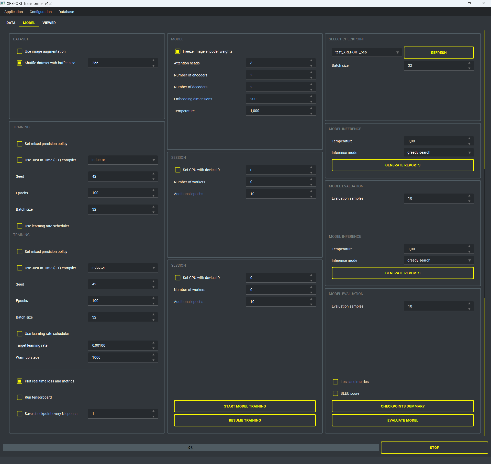
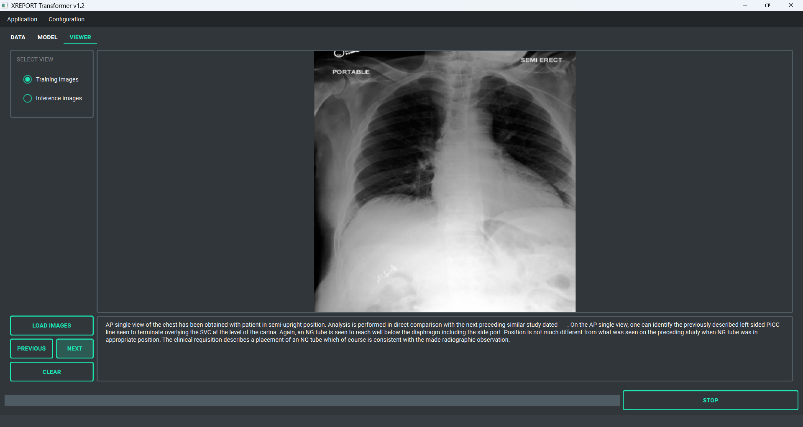

# XREPORT: Radiological Reports Generation

## 1. Introduction
XRAY Report Generator is a machine learning-based tool designed to assist radiologists in generating descriptive reports from X-ray images. This project aims to reduce the time and effort required by radiologists to write detailed reports based on the XRAY scan description, thereby increasing efficiency and turnover. The generative model is trained using combinations of XRAY images and their labels (descriptions), in the same fashion as image captioning models learn a sequence of word tokens associated to specific parts of the image. While originally developed around the MIMIC-CXR Database (https://www.kaggle.com/datasets/wasifnafee/mimic-cxr), this project can be applied to any dataset with X-ray scans labeled with their respective radiological reports (or any kind of description). The XREPORT Deep Learning (DL) model developed for this scope makes use of a transformer encoder-decoder architecture, which relies on both self attention and cross attention to improve text significance within the clinical image context. The images features are extracted using a custom convolutional encoder with pooling layers to reduce dimensionality. Once a pretrained model is obtained leveraging a large number of X-RAY scans and their descriptions, the model can be used in inference mode to generate radiological reports from the raw pictures.

**Current application capabilities**

- End-to-end workflow that covers dataset profiling, preprocessing, model training, checkpoint management, inference, and visualization within a single desktop interface.
- Portable Windows distribution with an embedded Python 3.12 runtime, uv-based dependency management, and one-click bootstrap scripts. Manual instructions for Linux and macOS are also provided.
- Dataset governance utilities including CSV/SQLite ingestion, schema validation, train/validation splits, pixel-statistics dashboards, and tokenization quality checks.
- Transformer-based training loop with resuming, mixed precision, torch.compile acceleration, integrated callbacks, gradient monitoring, BLEU scoring, and auto-saved checkpoints.
- Rich inference experience that supports greedy, beam-search, and temperature sampling strategies as well as side-by-side comparison with ground-truth narratives.
- Visual analytics area hosting real-time plots (loss, accuracy, BLEU) and curated galleries for both training and inference imagery to support qualitative auditing.

## 2. XREPORT model
The XREPORT model leverages a robust transformer encoder-decoder architecture to generate detailed radiology reports from X-ray images. It begins by extracting rich image features using a state-of-the-art, pretrained image encoder (*beit-base-patch16-224*) that is integrated into the captioner model. This vision transformer model utilizes the BEiT architecture, which is designed to pre-train image transformers in a manner analogous to BERT in natural language processing, enabling efficient feature extraction from images for various vision tasks.

Architecture of BeiT models

Subsequently, the stacked transformer encoders, each equipped with multi-head self-attention and feedforward networks, further process these refined image vectors. These encoders produce high-level feature representations that capture the essential characteristics of the scans. The transformer decoder then employs a cross-attention mechanism to align the image features with specific words during report generation. To maintain coherence and context throughout the generated report, the model utilizes causal masking in its auto-regressive decoding process, ensuring that each token is generated with full consideration of the preceding context.

General transformer model architecture

**Parametric tokenization:** to improve the vectorization and semantic representation of the training text corpus, this framework now supports multiple pretrained tokenizers from the Hugging Face library. By default, we use the distilbert/distilbert-base-uncased tokenizer, but the system can be configured to use a variety of models, such as BERT (bert-base-uncased), RoBERTa (roberta-base), GPT-2 (gpt2), and more, depending on the user's choice.

The tokenizer model is automatically downloaded and cached in *resources/models/tokenizers* on the first run, with the weights being reused for future training sessions. For word embedding, the XREPORT model uses positional embeddings, allowing it to encode the relative positions of tokens within sequences. Additionally, the model supports masking for variable-length sequences, ensuring adaptability to text inputs of different lengths. This flexibility allows seamless processing of diverse textual data while maintaining accurate and meaningful representations.

**Training and inference engines**

- *Training:* configurable learning rate schedulers, gradient clipping, teacher forcing warm-up, dataset shuffling, deterministic seeds, and resumable checkpoints. Validation hooks compute sparse categorical loss, accuracy, BLEU-1/2/3/4, and inference latency.
- *Inference:* supports greedy, beam, and sampling search with adjustable temperature and length penalties, and exports generated reports to CSV/SQLite for downstream review.
- *Metrics and monitoring:* callbacks stream loss/accuracy curves to the Viewer tab, persist history under *resources/logs*, and can emit JSON snapshots for automated QA pipelines.

## 3. Installation
The project targets Windows 10/11 and requires roughly 2 GB of free disk space for the embedded Python runtime, dependencies, checkpoints, and datasets. A CUDA-capable NVIDIA GPU is recommended but not mandatory. Ensure you have the latest GPU drivers installed when enabling TorchInductor + Triton acceleration.

1. **Download the project**: clone the repository or extract the release archive into a writable location (avoid paths that require admin privileges).
2. **Configure environment variables**: copy `XREPORT/resources/templates/.env` into `XREPORT/setup/.env` and adjust values (e.g., backend selection).
3. **Run `start_on_windows.bat`**: the bootstrapper installs a portable Python 3.12 build, downloads Astral’s `uv`, syncs dependencies from `pyproject.toml`, prunes caches, then launches the UI through `uv run`. The script is idempotent, rerun it any time to repair the environment or launch the app.

Running the script the first time can take several minutes depending on bandwidth. Subsequent runs reuse the cached Python runtime and only re-sync packages when `pyproject.toml` changes.

### 4.1 Just-In-Time (JIT) Compiler
`torch.compile` is enabled throughout the training and inference pipelines. TorchInductor optimizes the computation graph, performs kernel fusion, and lowers operations to Triton-generated kernels on NVIDIA GPUs or to optimized CPU kernels otherwise. Triton is bundled automatically so no separate CUDA toolkit installation is required.

### 4.2 Manual or developer installation
If you prefer managing Python yourself (for debugging or CI):

1. Install Python 3.12.x and `uv` (https://github.com/astral-sh/uv).
2. From the repository root run `uv sync` to create a virtual environment with the versions pinned in `pyproject.toml`.
3. Copy `.env` as described earlier and ensure the `KERAS_BACKEND` is set to `torch`.
4. Launch the UI with `uv run python XREPORT/src/app/app.py`.

## 5. How to use
Launch the application by double-clicking `start_on_windows.bat` (or via `uv run python XREPORT/src/app/app.py`). On startup the UI loads the last-used configuration, scans the resources folder, and initializes worker pools so long-running jobs (training, inference, validation) do not block the interface.

1. **Prepare data**: verify that `resources/database/images` (training) and `resources/database/inference` (inference) contain the expected files. Large datasets can be sub-sampled through the configuration dialog (`train_sample_size`).
2. **Adjust configuration**: use the toolbar to load/save configuration templates or modify each parameter manually from the UI.
3. **Run a pipeline**: pick an action under the Data, Model, or Viewer tabs. Progress bars, log panes, and popup notifications keep you informed. Background workers can be interrupted at any time.

**Data tab:** analyze and validate the image and text dataset using different metrics.

- **Automatic CSV and SQLite ingestion**: load metadata from *database/dataset/XREPORT_dataset.csv* or from the embedded SQLite file and preview the cleaned table before committing changes.
- **Calculation of images statistics**: pixels mean values, standard deviation, values range, noise ratio.
- **Calculation of average pixel distribution** plus drift checks that highlight modality shifts between folds.
- **Average pixel distribution of train versus validation** with live histograms and summary cards.
- **Report pre-processing pipeline**: configurable text cleaning (case folding, punctuation removal, stopword filtering), token balancing, and vocabulary pruning.
- **Tokenization tests**: visualize tokenizer coverage, rare tokens, BOS/EOS padding, and verify that max length limits are honored.

Also allows building the ML dataset that will be used for training the XREPORT model. Prepare the reports dataset for machine learning by processing the source data through the following steps:
- **Text cleaning for X-ray reports**
- **Tokenization of reports**
- **Mapping of images path with their corresponding labels**
- **Train and validation dataset splitting** with deterministic seeds, stratified sampling, and imbalance warnings.
- **Export helpers** to persist the processed samples as parquet, CSV, or SQLite tables for reproducibility.

**Models tab:** through this tab one can train the XREPORT transformer from scratch or resume training for previously trained checkpoints. Moreover, this section provides both model inference and evaluation functionalities. Use the pretrained transformer decoder from a model checkpoint to generate radiological reports from input images. Reports can be generated using various auto-regressive strategies, including greedy search and beam search, temperature sampling, and nucleus sampling. Moreover, the XREPORT transformer model can be evaluated using different metrics, such as:

- **Average mean sparse categorical loss and accuracy** 
- **Calculation of BLEU scores** (1–4) along with ROUGE-L and average report length
- **Per-token attention diagnostics** stored as NumPy arrays for offline inspection
- **Checkpoint manager** to promote, archive, or delete runs, and to export ONNX weights for deployment

**Viewer tab:** visualization hub.
- Browse training and inference images, as well as plots generated during dataset or model evaluation.
- Useful for quick sanity checks without leaving the application.

### 5.1 Setup and Maintenance
`setup_and_maintenance.bat` launches a lightweight maintenance console with these options:

- **Update project**: performs a `git pull` (or fetches release artifacts) so the local checkout stays in sync.
- **Remove logs**: clears `resources/logs` to save disk space or to reset diagnostics before a new run.
- **Open tools**: quick shortcuts to DB Browser for SQLite or other external utilities defined in the script.

### 5.2 Resources
The `XREPORT/resources` tree keeps all mutable assets, making backups and migrations straightforward:

- **checkpoints** — versioned folders containing saved models, training history, evaluation reports, reconstructed samples, and the JSON configuration that produced them. These folders are what you load when resuming training or running inference.
- **configurations** — reusable JSON presets saved through the UI dialogs.
- **database** — includes sub-folders for `images` (training data), `inference` (raw inputs and exported `.npy` embeddings), `metadata` (SQLite records), and `validation` (plots + stats reports).
- **logs** — rotating application logs for troubleshooting. Attach these when reporting issues.
- **models:** shared cache for Hugging Face tokenizers and any ONNX exports generated during evaluation.
- **templates** — contains `.env` and other templates that need to be copied into write-protected directories (`XREPORT/app`).

Environmental variables reside in `XREPORT/setup/.env`. Copy the template from `resources/templates/.env` and adjust as needed:

| Variable              | Description                                                               |
|-----------------------|---------------------------------------------------------------------------|
| KERAS_BACKEND         | Backend for Keras 3; keep `torch` unless you explicitly need TensorFlow.  |
| TF_CPP_MIN_LOG_LEVEL  | Controls TensorFlow logging verbosity (set to `2` to suppress INFO logs). |
| MPLBACKEND            | Matplotlib backend; `Agg` keeps plotting headless for worker threads.     |

## 5. License
This project is licensed under the terms of the MIT license. See the LICENSE file for details.

