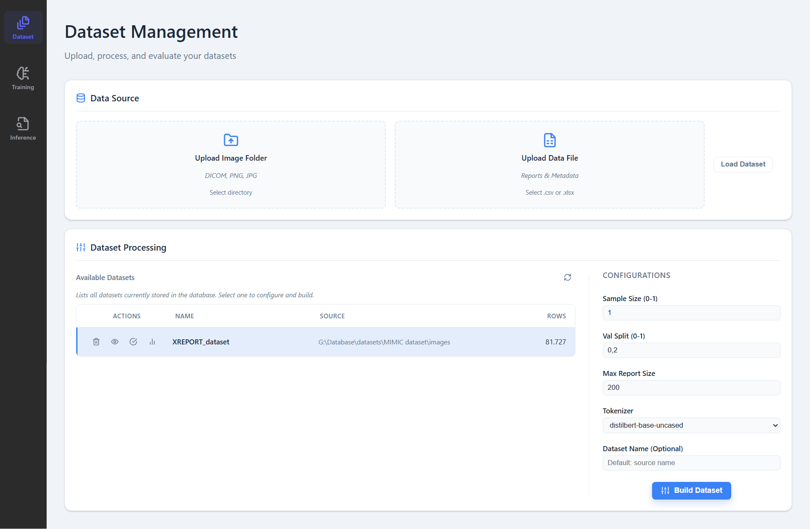
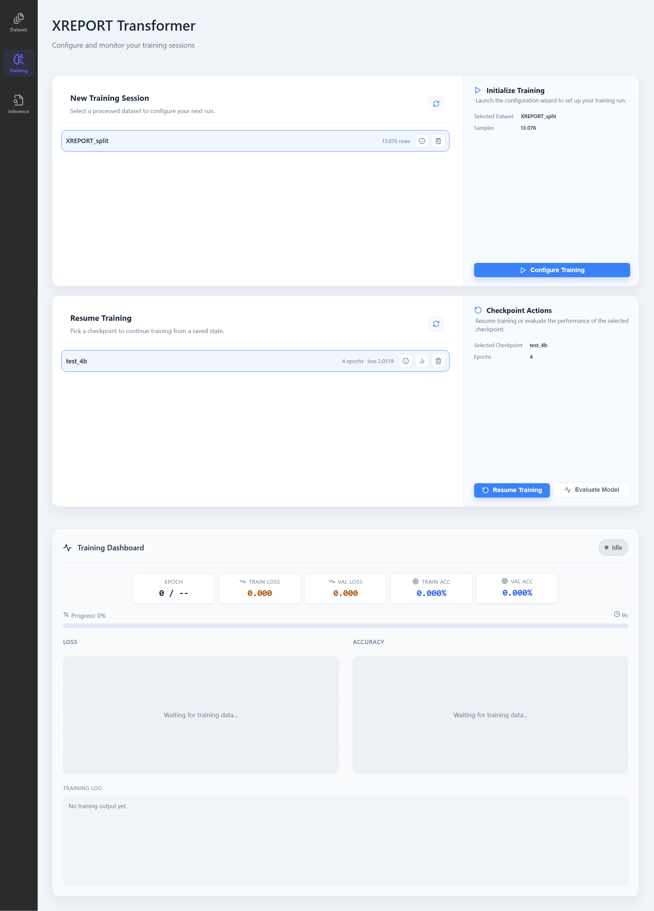
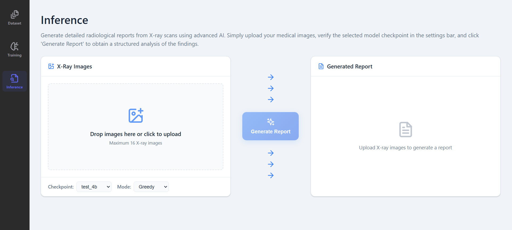

# XREPORT Radiological Reports Generator

## 1. Project Overview

XREPORT is a client-server application designed to generate draft radiological reports from X-ray images. It leverages a vision-language machine learning workflow to interpret visual data and produce consistent, text-based diagnostic descriptions.

The system is architected as:
- **Backend**: A FastAPI service managing data processing, model training, and inference logic.
- **Frontend**: A comprehensive web UI for configuring datasets, monitoring training progress in real-time, and reviewing generated reports.

This tool aims to accelerate the reporting workflow for radiologists by providing high-quality, editable drafts.

Runtime supports three execution modes:
- **Local mode (v1)**: web app launched by `XREPORT/start_on_windows.bat`.
- **Local mode (v2)**: packaged Windows desktop application built with Tauri.
- **Cloud mode**: Dockerized backend + frontend with same-origin `/api` proxying.

> **Work in Progress**: This project is still under active development. It will be updated regularly, but you may encounter bugs, issues, or incomplete features.

---

## 2. Model and Dataset (Optional)

XREPORT employs an image captioning model trained via supervised learning. It learns mappings between visual pathologies in X-ray images and their corresponding textual descriptors in radiology reports.

The system is designed to work with:
- **MIMIC-CXR**: Initially validated on this public dataset.
- **Custom Datasets**: User-provided datasets that follow the supported image-text pairing structure.

---

## 3. Installation

### 3.1 Windows (One Click Setup, Local Mode v1)

The project includes an automated setup script for Windows: `XREPORT/start_on_windows.bat`.

The launcher performs the following:
1. Downloads portable runtimes (Python, Node.js) to `XREPORT/resources/runtimes`.
2. Installs all backend and frontend dependencies (including `uv` and `npm` packages).
3. Builds the frontend client for local serving.
4. Launches the backend server and opens the web interface.

**Note**: The first run will take time to download runtimes and compile dependencies. Subsequent runs check for updates and launch immediately.

### 3.2 Windows (Packaged Desktop, Local Mode v2)

Build prerequisites:
- Rust toolchain (stable) + Cargo
- Node.js 22.x + npm
- WebView2 runtime (normally present on modern Windows)

Build steps:
```bat
copy /Y XREPORT\settings\.env.local.tauri.example XREPORT\settings\.env
cd XREPORT\client
npm ci
npm run tauri:build
```

The installer/bundle output is generated by Tauri under `XREPORT/client/src-tauri/target`.

### 3.3 macOS / Linux (Manual Setup)

**Prerequisites**:
- Python 3.14.x
- Node.js 22.x + npm
- uv (recommended)

**Setup Steps**:

1. **Configure Environment**: Copy or edit `XREPORT/settings/.env` to match your local ports.
2. **Backend Setup**:
   ```bash
   uv sync
   # Optional: uv sync --all-extras for test dependencies
   ```
3. **Frontend Setup**:
   ```bash
   cd XREPORT/client
   npm ci
   npm run build
   ```

### 3.4 Cloud Mode (Docker)

1. Select cloud profile:
   ```bat
   copy /Y XREPORT\settings\.env.cloud.example XREPORT\settings\.env
   ```
2. Build and start:
   ```bat
   docker compose --env-file XREPORT/settings/.env up --build -d
   ```
3. Open frontend: `http://127.0.0.1:<UI_PORT>`
4. API docs through same origin proxy: `http://127.0.0.1:<UI_PORT>/api/docs`

---

## 4. How to Use

### 4.1 Windows (Local Mode v1)

Launch the application by double-clicking `XREPORT/start_on_windows.bat`.

- **Web UI**: Opens automatically at `http://<UI_HOST>:<UI_PORT>` from `XREPORT/settings/.env`.
- **Backend**: Runs on `http://<FASTAPI_HOST>:<FASTAPI_PORT>` from `XREPORT/settings/.env`.

### 4.2 Windows (Local Mode v2)

Install and run the generated Tauri package.

Runtime behavior:
- The desktop shell starts `XREPORT/start_on_windows_tauri.bat --backend` in the background.
- Backend listens on `FASTAPI_HOST` / `FASTAPI_PORT` from `XREPORT/settings/.env`.
- The desktop window loads the local backend origin once ready.

### 4.3 macOS / Linux

**Backend**:
```bash
uv run python -m uvicorn XREPORT.server.app:app --host 127.0.0.1 --port 8000
```

**Frontend** (Preview Mode):
```bash
cd XREPORT/client
npm run preview -- --host 127.0.0.1 --port 7861 --strictPort
```

### 4.4 Mode Switching

The active runtime file is always `XREPORT/settings/.env`.

- Local defaults (v1):
  ```bat
  copy /Y XREPORT\settings\.env.local.example XREPORT\settings\.env
  ```
- Local defaults (v2):
  ```bat
  copy /Y XREPORT\settings\.env.local.tauri.example XREPORT\settings\.env
  ```
- Cloud defaults:
  ```bat
  copy /Y XREPORT\settings\.env.cloud.example XREPORT\settings\.env
  ```

### 4.5 Using the Application

The application workflow is divided into four main areas:

**Dataset Management**

The **Dataset** page allows you to prepare your data. It features a refined configuration panel for setting preprocessing parameters and an "Available Datasets" browser to view and select local datasets. Use this section to validate image-report pairs before training.



**Training Dashboard**

The **Training** page provides a real-time view of model performance. The dashboard layout features consolidated, single-row score panels for immediate visibility of key metrics (Loss, Reward). You can start, pause, and configure training runs, with live plotting synchronized to the backend.



**Validation & Inference**

The **Inference** page handles model evaluation. It includes a **Checkpoint Evaluation Wizard** with an optimized layout for assessing saved model checkpoints. Users can generate reports from new X-ray images and review the model's output quality.



## 5. Setup and Maintenance

Use `XREPORT/setup_and_maintenance.bat` (Windows) to manage the installation.

Available actions:
- **Remove logs**: Clears the `XREPORT/resources/logs` directory.
- **Uninstall app**: Removes all portable runtimes, virtual environments (`.venv`), and build artifacts to clean the directory.
- **Initialize database**: Resets the local SQLite database used by the backend.

## 6. Resources

The `XREPORT/resources` directory contains project assets and artifacts:

- **checkpoints/**: Saved model weights and training states.
- **database/**: Contains the SQLite database file (`sqlite.db`) and local dataset storage.
- **logs/**: Backend and training logs.
- **models/**: Cached external model components (tokenizers, encoders).
- **runtimes/**: (Windows only) Portable Python, uv, and Node.js environments.
- **templates/**: Standard document templates for reports.

## 7. Configuration

Configurations are split between environment variables and JSON settings.

- **Active environment profile**: `XREPORT/settings/.env`
- **Profile templates**:
  - `XREPORT/settings/.env.local.example`
  - `XREPORT/settings/.env.local.tauri.example`
  - `XREPORT/settings/.env.cloud.example`
- **Backend/Training JSON defaults (non-runtime)**: `XREPORT/settings/configurations.json`

For packaging/runtime details see `assets/docs/PACKAGING_AND_RUNTIME_MODES.md`.

## 8. License

This project is licensed under the MIT License. See the `LICENSE` file for details.

