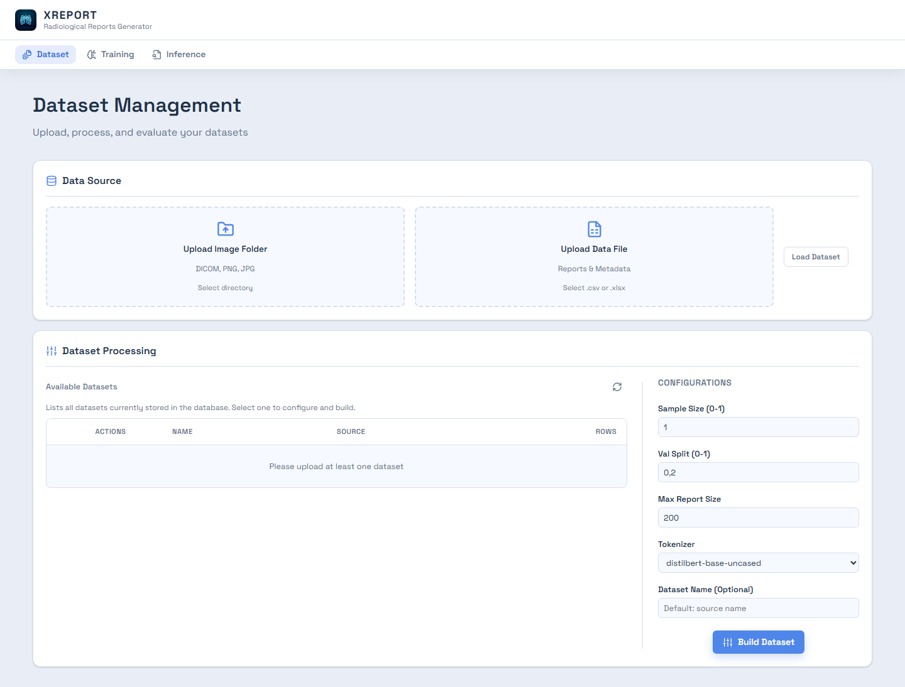
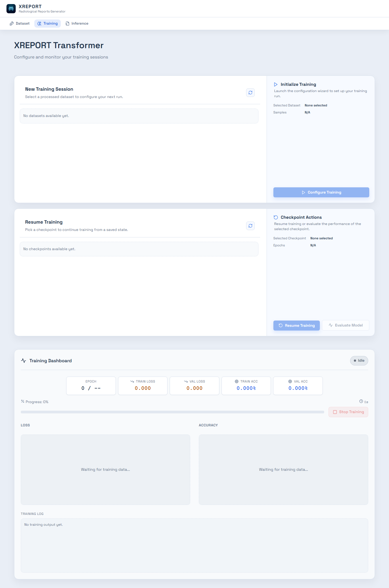
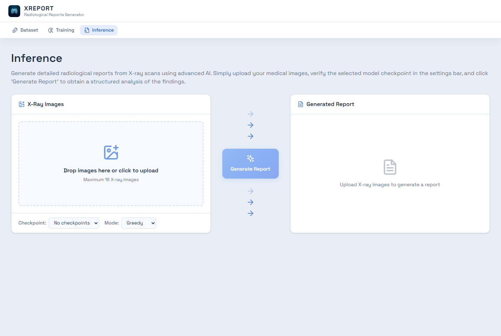

# XREPORT Radiological Reports Generator

[](https://github.com/CTCycle/XREPORT-radiological-reports-generator/releases)
[](https://www.python.org/downloads/)
[](https://nodejs.org/)
[](LICENSE)
[](https://github.com/CTCycle/XREPORT-radiological-reports-generator/actions/workflows/ci.yml)

## 1. Project Overview

XREPORT is a client-server application that generates draft radiological reports from X-ray images.
It combines a FastAPI backend and a React frontend to support end-to-end workflows for dataset preparation, model training, validation, and report generation.

Runtime supports two execution modes:
- **Local mode (v1)**: web app launched by `XREPORT/start_on_windows.bat`.
- **Local mode (v2)**: packaged Windows desktop application built with Tauri.

> **Work in Progress**: The project is under active development and may contain incomplete features.

---

## 2. Model and Dataset (Optional)

XREPORT uses an image-captioning workflow trained via supervised learning to map X-ray findings to text report drafts.

Supported data sources:
- **MIMIC-CXR** (initial validation dataset)
- **Custom datasets** following the supported image-report pair format

---

## 3. Installation

### 3.1 Windows (One-Click Setup, Local mode v1)

Run:
- `XREPORT/start_on_windows.bat`

The launcher downloads portable runtimes into `runtimes/`, installs backend/frontend dependencies, builds the client, and starts the application.

### 3.2 Windows (Packaged Desktop, Local mode v2)

Prerequisites for maintainers/build machines:
- Rust toolchain (stable)
- Node.js 22.x + npm
- WebView2 runtime

Build:
```bat
release\tauri\build_with_tauri.bat
```

Outputs:
- `release\windows\installers`
- `release\windows\portable`

### 3.3 macOS / Linux (Manual Setup)

Prerequisites:
- Python 3.14+
- Node.js 22.x + npm
- uv

Setup:
```bash
uv sync
cd XREPORT/client
npm ci
npm run build
```

---

## 4. How to Use

### 4.1 Launch

Windows (Local mode v1):
- Run `XREPORT/start_on_windows.bat`

Windows (Local mode v2):
- Install and start the packaged Tauri app

macOS/Linux (manual):
```bash
uv run python -m uvicorn XREPORT.server.app:app --host 127.0.0.1 --port 5002
cd XREPORT/client
npm run preview
```

### 4.2 Core Workflow

1. Prepare or load dataset on the **Dataset** page.
2. Start training and monitor progress on the **Training** page.
3. Generate draft reports on the **Inference** page.
4. Run dataset/checkpoint validation from **Validation** flows.

### 4.3 UI Snapshots

- **Dataset management**: data source selection and dataset processing configuration.
  
- **Training workspace**: training session setup, checkpoint actions, and training dashboard.
  
- **Inference workspace**: X-ray upload, checkpoint selection, and report generation panel.
  

For a full operator guide, see `assets/docs/USER_MANUAL.md`.

---

## 5. Setup and Maintenance

Use `XREPORT/setup_and_maintenance.bat` (Windows) to:
- remove logs
- uninstall app runtimes/artifacts
- clean desktop build artifacts
- initialize/reset local database

---

## 6. Resources

Runtime data is stored under `XREPORT/resources`:
- `checkpoints/`
- `logs/`
- `models/`
- `templates/`
- database file (`database.db`)

On Windows, portable runtimes and runtime virtual environment are stored in `runtimes/`.

---

## 7. Configuration

- Runtime/process settings: `XREPORT/settings/.env`
- Backend defaults (including DB mode): `XREPORT/settings/configurations.json`

### 7.1 Database initialization behavior

- SQLite mode (`database.embedded_database=true`):
  - On application startup, if `XREPORT/resources/database.db` does not exist, the app initializes the SQLite schema automatically.
  - If the file already exists, startup skips initialization.
- PostgreSQL mode (`database.embedded_database=false`):
  - Application startup never initializes PostgreSQL automatically.
  - PostgreSQL initialization is manual via `XREPORT/setup_and_maintenance.bat` option `1`, which runs `XREPORT/scripts/initialize_database.py`.
  - The same script can also initialize SQLite if SQLite mode is active, but this is optional because SQLite auto-initializes on first startup.

See also:
- `assets/docs/PACKAGING_AND_RUNTIME_MODES.md`
- `assets/docs/USER_MANUAL.md`

---

## 8. License

This project is licensed under the MIT License. See `LICENSE`.
