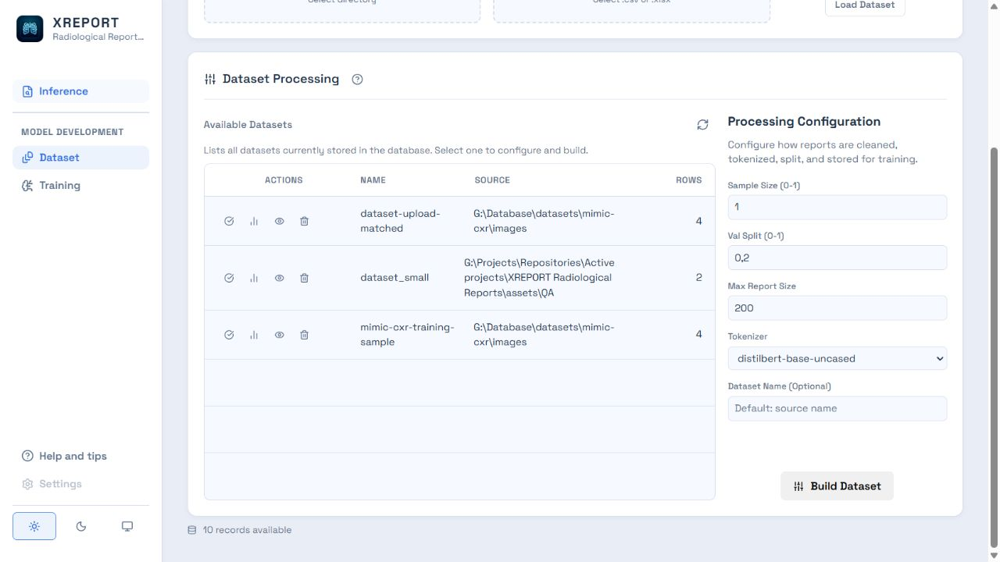

# XREPORT Radiological Reports Generator

[](https://github.com/CTCycle/XREPORT-radiological-reports-generator/releases)
[](https://www.python.org/downloads/)
[](https://nodejs.org/)
[](https://ctcycle.github.io/CTCycle/)
[](LICENSE)
[](https://github.com/CTCycle/XREPORT-radiological-reports-generator/actions/workflows/ci.yml)

## 1. Project Overview

XREPORT is a client-server research application that generates editable draft radiological reports from X-ray images. Models and generated drafts are not clinically approved and require qualified independent review.
It combines a FastAPI backend and an Angular 22 frontend to support end-to-end workflows for dataset preparation, model training, validation, and report generation.

The application runs locally as a FastAPI backend with an Angular-served web interface. On Windows, `start_on_windows.ps1` manages the portable runtimes, dependencies, and processes.


## 2. Model and Dataset (Optional)

XREPORT supports its trained image-captioning checkpoints plus a fixed five-model Hugging Face Transformers catalogue. Selected public models are downloaded on first Generate into the project-local resource cache (under `app/resources` by default), verified, and reused offline on subsequent launches; no separate model server is required.

Supported data sources:
- **MIMIC-CXR** (initial validation dataset)
- **Custom datasets** following the supported image-report pair format


## 3. Installation

### 3.1 Windows (One-Click Setup)

Run:
- `powershell -ExecutionPolicy Bypass -File .\start_on_windows.ps1`

The launcher menu can launch the app, install or update dependencies, rebuild the frontend only, initialize the database, run tests, remove logs, clear caches, and uninstall generated dependencies.

### 3.3 Windows desktop packages

The repository also contains a Tauri 2 desktop shell under `app/desktop`. It
starts the frozen FastAPI service itself, serves the already-built Angular
client, waits for a dynamic loopback health contract, and shuts the service
down gracefully. The ordinary browser launcher remains unchanged.

Development shell (source backend and visible consoles):

```powershell
powershell -ExecutionPolicy Bypass -File .\start_on_windows.ps1 -Action LaunchDesktopDev
```

Release packaging is Windows x64 only. A clean tree is required for a normal
release; `-AllowDirtyTree` is an explicit diagnostic override:

```powershell
powershell -ExecutionPolicy Bypass -File .\start_on_windows.ps1 `
  -Action BuildDesktopRelease -DesktopRuntime All -DesktopTarget All -Version 1.0.0
# Diagnostic build of the same four artifacts:
powershell -ExecutionPolicy Bypass -File .\start_on_windows.ps1 `
  -Action BuildDesktopRelease -DesktopRuntime All -DesktopTarget All -Version 1.0.0 `
  -AllowDirtyTree -Force
```

Use `-DesktopRuntime Cpu|Cuda` and `-DesktopTarget Portable|Msi` to narrow a
build. MSI embeds the WebView2 bootstrapper by default; pass
`-OfflineWebView2` only when an offline WebView2 installer is intentionally
available. `-Action RemoveDesktopRelease` removes generated release, staging,
and Cargo output without touching user data.

Artifacts are written to `release/` with standard SHA-256 manifests:

* `XREPORT-v1.0.0-windows-x64-cpu-portable.exe` and `.msi`
* `XREPORT-v1.0.0-windows-x64-cuda-portable.exe` and `.msi`
* one `.sha256` file per variant plus a build metadata JSON file

Portable artifacts are self-contained single EXEs: the frozen runtime ZIP is
streamed into a PE overlay. MSI artifacts carry the same verified ZIP as an
immutable installer resource. The raw Tauri shell under
`app/desktop/src-tauri/target` is not itself a portable release artifact.

The builds are currently unsigned. Portable execution requires the maintained
system WebView2 runtime; MSI installation is per-machine and normally needs
administrator approval. CPU and CUDA products have separate identifiers and
shortcuts but share one per-user instance guard, so only one XREPORT desktop
variant can run at a time.

### 3.2 macOS / Linux (Manual Setup)

Prerequisites:
- Python 3.14+
- Node.js 22.x + npm
- uv

Setup:
```bash
cd app/server
uv sync
cd app/client
npm ci
npm run build
```


## 4. How to Use

### 4.1 Launch

Windows:
- Run `powershell -ExecutionPolicy Bypass -File .\start_on_windows.ps1` and select **Launch application**.

macOS/Linux (manual):
```bash
cd app
uv run --project server python -m uvicorn server.app:app --host 127.0.0.1 --port 5003
cd client
npm run preview -- --host 127.0.0.1 --port 8003
```

Database migrations are applied automatically during installation and backend
startup. To initialize or upgrade the configured database explicitly:

```powershell
powershell -ExecutionPolicy Bypass -File .\start_on_windows.ps1 -Action InitializeDatabase
```

For migration development, run Alembic from `app/server` and review generated
revisions before committing them:

```powershell
uv run alembic -c alembic.ini current --check-heads
uv run alembic -c alembic.ini revision --autogenerate -m "describe schema change"
uv run alembic -c alembic.ini upgrade head
```

### 4.2 Core Workflow

1. Prepare or load dataset on the **Dataset** page.
2. Start training and monitor progress on the **Training** page.
3. Generate draft reports on the **Inference** page.
4. Run dataset/checkpoint validation from **Validation** flows.

### 4.3 UI Snapshots

The screenshots below were captured from the current Windows web interface at a consistent 1280×740 normal viewport. Scrollable workflows use separate, focused frames so important content stays readable; the images are not stitched full-page captures.

#### Dataset handling

The Dataset page shows imported sources, record counts, and the processing configuration used to turn source data into a training-ready dataset.




#### Training dashboard

This completed small training run shows real progress, eight plotted loss/accuracy points, final metrics, and the session log in one place.


#### Inference workflow

The public model catalogue makes readiness and provenance visible before use. The selected CXRMate Multi TF model is an open, lightweight chest-X-ray reporter.


The workflow then keeps the study image, generation controls, and multi-view input state visible while the draft is produced.


The editable review panel presents the generated Findings and Impression together with the model and provider metadata needed for qualified review.


#### Help & Tips

The Tips & Tricks panel provides contextual onboarding, completed workflow steps, and guidance for resuming from an existing checkpoint.


For operator guidance, see `assets/docs/operations/getting_started.md` and `assets/docs/operations/workflows.md`.


## 5. Setup and Maintenance

Use `powershell -ExecutionPolicy Bypass -File .\start_on_windows.ps1` on Windows to access the consolidated launch and maintenance menu.


## 6. Resources

Runtime data is stored under `app/resources` by default. Set
`XREPORT_RESOURCES_DIR` in `settings/.env` to use another absolute path or a
path relative to the repository root:
- `checkpoints/`
- `logs/`
- `models/`
- `templates/`
- database file (`database.db`)

On Windows, portable runtimes and runtime virtual environment are stored in `runtimes/`.

Disposable runtime caches are stored under `runtimes/cache`; pytest, Ruff, and
other development-tool caches are stored under `app/tests/cache`. Use
`.\start_on_windows.ps1 -Action ClearCache` to remove them. Cleanup skips
locked or administrator-protected files and continues with the remaining
artifacts.

Packaged desktop mode never writes mutable state into the installation
directory. Immutable extracted files live under
`%LOCALAPPDATA%\XREPORT\runtime\<cpu|cuda>\1.0.0\<payload-sha256>`. Runtime data,
the seeded `.env`, configuration, SQLite database, logs, checkpoints, model
downloads, tokenizers, templates, and caches live under
`%LOCALAPPDATA%\XREPORT\data`. Data intentionally survives MSI upgrades and
uninstall; remove that directory manually only when a full reset is wanted.


## 7. Configuration

- Runtime/process settings: `settings/.env`
- Backend defaults: `settings/configurations.json`
- Database configuration: `settings/.env`
- Curated local inference catalog: `settings/inference_models.json`

### 7.1 Database initialization behavior

- On backend startup, a missing `settings/.env` is copied from
  `settings/.env.example`. An existing `settings/.env` is never overwritten,
  and `.env` files are excluded by `.gitignore`.
- SQLite mode (`EMBEDDED_DATABASE=true`):
  - On application startup, if `<resource root>/database.db` does not exist, the app initializes the SQLite schema automatically.
  - If the file already exists, startup does not recreate, reset, reseed, or cross-validate it.
- PostgreSQL mode (`EMBEDDED_DATABASE=false`):
  - Normal startup only verifies a connection to the configured database and never creates or initializes it.
  - Select option `4` in `start_on_windows.ps1` to create the configured database and schema explicitly.

See also `assets/docs/` for architecture, runtime, operations, and troubleshooting guidance.

Packaged mode ignores a source-relative `XREPORT_RESOURCES_DIR`. The shell
passes a per-launch 256-bit token to the backend; the one-time bootstrap URL is
stored only in the user-scoped session file and becomes an HttpOnly,
host-only, `SameSite=Strict` cookie. Native health/shutdown probes use a
private header. The packaged server adds same-origin CSP and standard browser
hardening headers, and it exposes no Tauri filesystem, shell, process, or
arbitrary-opener capability to the Angular content.


## 8. Development Status

This project is under active development and may contain incomplete features. The initial production-ready release is v1.0.0, which is stable for local evaluation and testing.

## 9. License

This project is licensed under the MIT License. See `LICENSE`.
