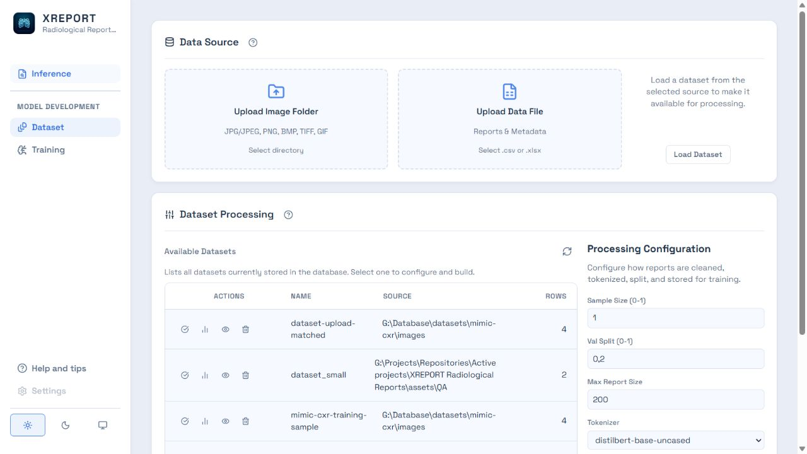
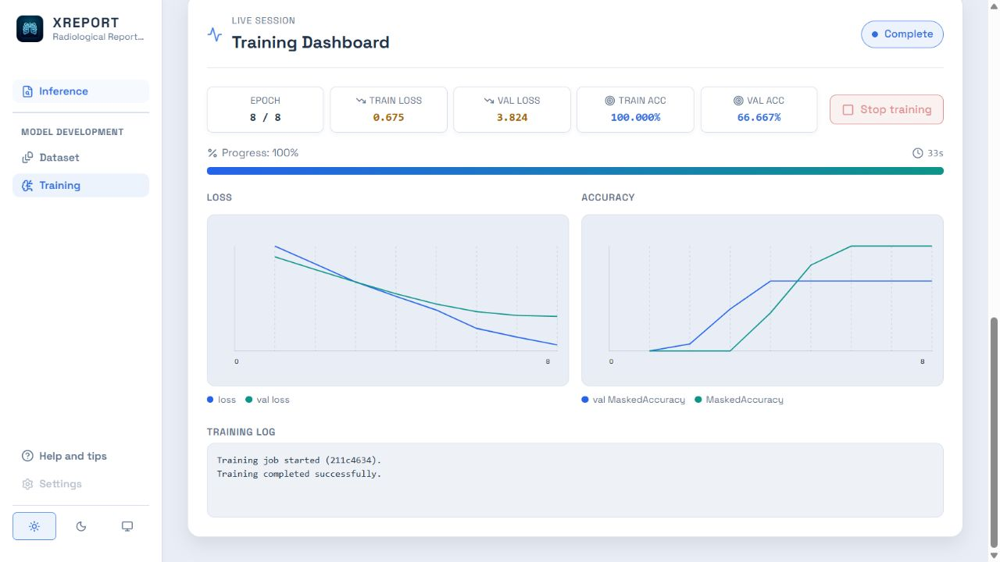
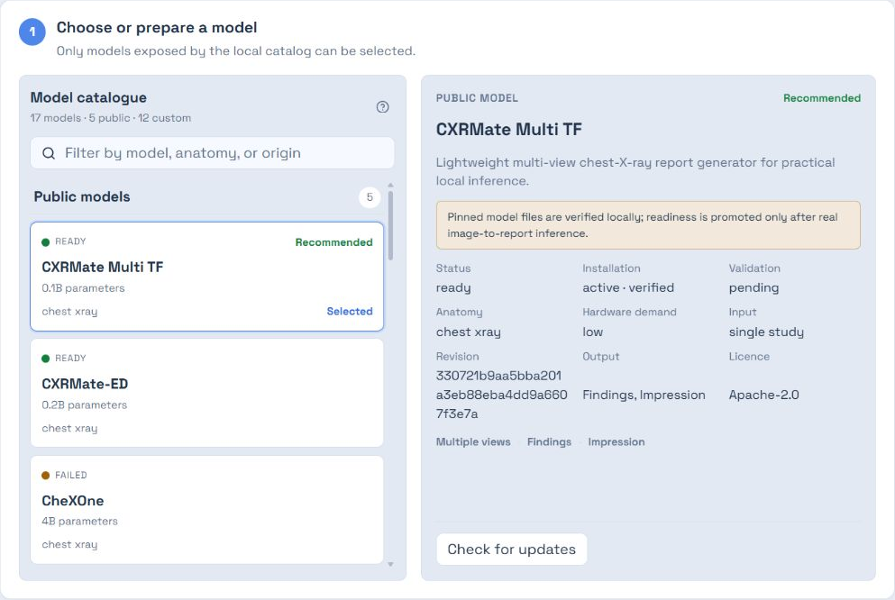
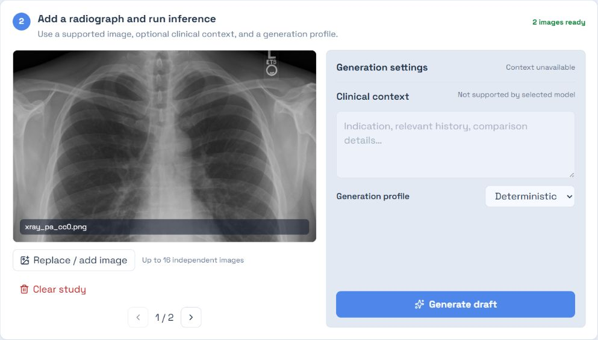
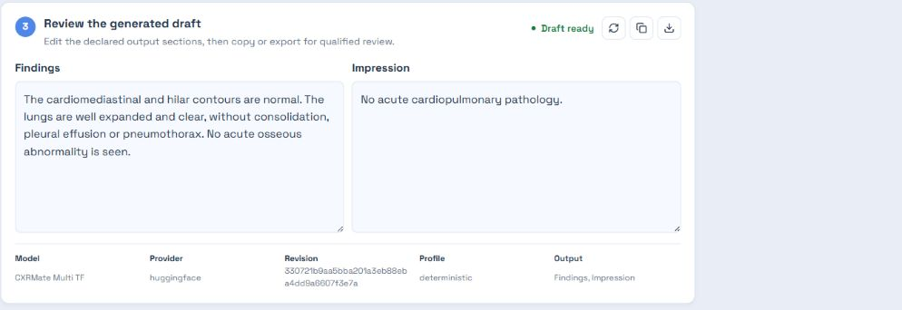
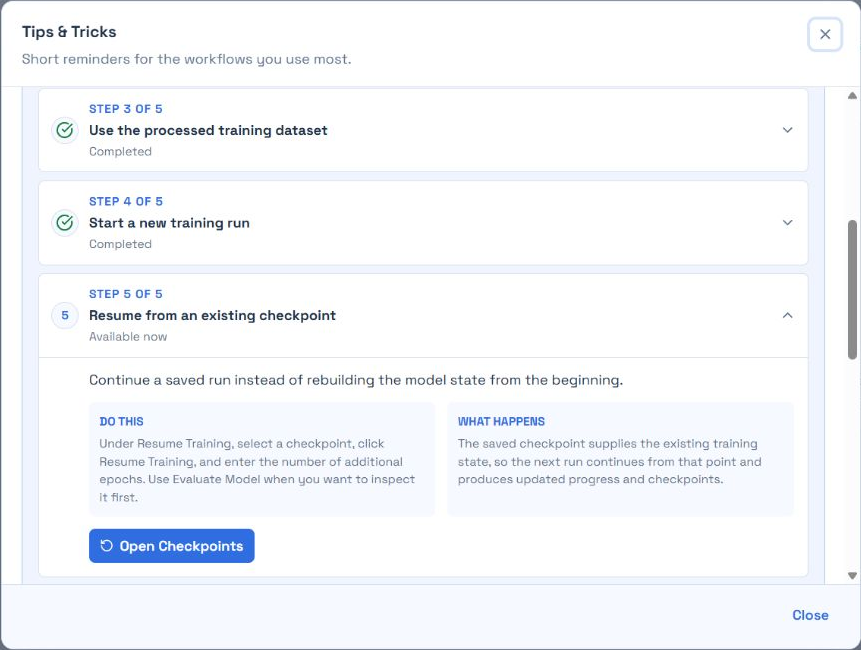

# XREPORT Radiological Reports Generator

Last updated: 2026-08-31

## 1. What XREPORT is

XREPORT is a local-first research application that generates editable draft
radiological reports from X-ray images. It helps users prepare image/report
datasets, train and evaluate local models, and compare report-generation
models in a single workflow.

The application is designed to support research and evaluation. It is not a
diagnostic device, a replacement for a radiologist, or a clinically approved
reporting system. Models and generated drafts can be wrong even when the text
looks plausible. A qualified professional must independently review every
draft before it is used for any research or clinical decision.

### What you can do

- import image folders and report tables, review matches, and prepare a usable
  dataset
- train or resume a local model while monitoring progress and metrics
- evaluate datasets and saved model checkpoints
- choose from five curated public report-generation models or use a locally
  trained Custom XReport model
- generate an editable draft from a de-identified X-ray study
- review and edit the generated Findings and Impression, inspect the model
  information returned with the draft, and copy or export the text for
  qualified review
- keep model readiness, validation state, provenance, and research-use
  warnings visible throughout the workflow

## 2. How it works

XREPORT follows a simple path from source data to a reviewable draft:

1. **Prepare the data.** Images are paired with their corresponding reports.
   The application checks those pairings and lets you inspect unmatched rows
   before anything is used downstream.
2. **Train or evaluate.** A prepared dataset can be used to train a local
   model, resume a previous run, or evaluate a saved checkpoint. Progress and
   quality indicators remain visible while a run is active.
3. **Generate a draft.** A selected model examines one or more study images and
   produces report text. The selected model determines its supported anatomy,
   image limit, optional clinical context, and resource requirements.
4. **Review the result.** The draft remains editable. Findings describe the
   observations in the images, while Impression provides a shorter summary of
   the main conclusion. Both sections must be checked against the source
   images by a qualified reviewer.

### The underlying principle

XREPORT uses image-to-text models. These models learn statistical relationships
between visual patterns and example reports; they do not reason like a human
radiologist and they do not guarantee that a generated statement is true.
Training data, model scope, image quality, and the chosen generation settings
all affect the result. Evaluation metrics can help compare experiments, but
they are not a substitute for clinical validation.

The application is local-first. Report generation runs on the selected local
model, and application data is kept on the local machine by default. A public
model may need to be downloaded and verified the first time it is used. After
that, the verified local copy can be reused without downloading it again.

## 3. Models and data

### Public models

The application presents five curated public model choices. Each model card
shows the information needed to make an informed choice, including:

- the anatomy and type of studies the model is intended for
- whether it is ready locally or needs to be downloaded
- approximate storage and hardware demand
- licence and access requirements
- the report sections and input options it supports

The first four public choices are specialized for chest X-rays. The fifth is a
broader medical-imaging option and should not be treated as universally
validated for every anatomy. Some models are gated by their provider and may
require accepting terms before they can be downloaded.

Public models are downloaded only when needed, verified locally, and reused on
later launches. Keep an internet connection available for first use and make
sure the computer has enough free storage for the selected model.

### Custom datasets and checkpoints

XREPORT supports:

- **MIMIC-CXR**, used as the initial validation dataset
- **Custom datasets** containing image/report pairs in the supported table
  format
- **Custom XReport models**, created from local training runs and kept separate
  from the public model catalogue

Use only data that you are authorized to process, and de-identify images and
reports before importing them. When a table contains rows that cannot be
matched to images, XREPORT shows the problem instead of silently using those
rows.

## 4. Installation and launch

### 4.1 Windows: recommended launch

From the repository root, run:

~~~powershell
powershell -ExecutionPolicy Bypass -File .\start_on_windows.ps1
~~~

Choose **Launch application**. The launcher prepares the local runtimes and
dependencies as needed, initializes the application data store, starts the
services, checks that they are ready, and opens the application in your
browser.

The first launch may take several minutes while dependencies and the frontend
are prepared. Allow the process to finish and keep an internet connection
available. Later launches are normally faster because the prepared resources
are reused.

For a direct launch without the menu, use:

~~~powershell
powershell -ExecutionPolicy Bypass -File .\start_on_windows.ps1 -Action Launch
~~~

The launcher also provides maintenance actions such as database
initialization, frontend rebuilding, cache cleanup, and dependency
preparation. Most users only need **Launch application**.

### 4.2 Optional Windows desktop packages

Some releases are also provided as Windows desktop packages:

- **CPU** packages are the general-purpose choice and work without a
  compatible graphics card.
- **CUDA** packages are intended for supported NVIDIA hardware and drivers.
- A **portable** package can be run directly.
- An **MSI** package installs XREPORT through the normal Windows installer and
  may request administrator approval.

Download the package that matches your hardware from the [GitHub Releases](https://github.com/CTCycle/XREPORT-radiological-reports-generator/releases) page.

The desktop package uses the same local application workflow as the browser
version. Portable execution requires a maintained Microsoft WebView2 runtime.
Only one XREPORT desktop instance can run at a time for the same Windows user.
Your application data is kept separately from the installed program so normal
updates do not remove datasets, checkpoints, or downloaded models.

### 4.3 macOS and Linux: manual local launch

There is no equivalent one-click launcher in this repository for macOS or
Linux. The manual flow requires Python 3.14 or newer, Node.js 22.x with npm,
and uv.

Install the project dependencies once from the repository root:

~~~bash
cd app/server
uv sync --frozen
cd ../client
npm ci
npm run build
~~~

Then use two terminals and keep both running while you use the application.

In Terminal 1, from the repository root, start the local service:

~~~bash
uv run --project app/server python -m uvicorn server.app:app --app-dir app --host 127.0.0.1 --port 5003
~~~

In Terminal 2, start the local web interface:

~~~bash
cd app/client
npm run preview -- --host 127.0.0.1 --port 8003
~~~

Open the local address shown by the frontend preview, normally
http://127.0.0.1:8003.

## 5. Using the application

### 5.1 Prepare a dataset

1. Open **Dataset**.
2. Select the folder containing the images and the table containing the
   corresponding report text and image references.
3. Load the source data and review the matched and unmatched counts.
4. If some rows are unmatched, correct the source data where possible. Import
   only the matched rows when a deliberately partial dataset is acceptable.
5. Run the preparation and processing steps, then confirm that the dataset is
   ready before using it for training or validation.

The matching review is important: a report paired with the wrong image can
produce misleading training results. XREPORT does not silently import rows it
cannot match.

### 5.2 Train and evaluate a model

1. Open **Training** and select a prepared dataset.
2. Review the configuration wizard and choose the available CPU or GPU
   options and training settings.
3. Start a run, then watch its progress, charts, and metrics.
4. Stop and resume a run when needed. Completed checkpoints remain available
   for later evaluation or inference.
5. Use the dataset-validation and checkpoint-evaluation actions to inspect the
   result before drawing conclusions from an experiment.

Training metrics are useful for monitoring and comparing runs. They do not
establish clinical safety, generalization to new hospitals, or diagnostic
accuracy.

### 5.3 Generate and review a report

1. Open **Inference** and read the research-use warning.
2. Select a ready public model or a complete Custom XReport checkpoint. Review
   its anatomy, image limit, resource demand, licence, access status, and
   readiness information.
3. Add de-identified images from one study, up to the limit shown for the
   selected model. Add clinical context only when the model supports it.
4. Choose a generation profile and submit the request. Generation runs as a
   background task, so the interface can show progress and allows an active
   request to be cancelled.
5. Read and edit the returned draft. Inspect the model, provider, revision,
   profile, and output information before copying or exporting it.

Changing the selected model, images, or generation profile clears the current
draft so that text from an earlier configuration is not mistaken for the new
result.

### 5.4 Review safely

Treat every result as a research-use draft. Compare the text with every source
image, check measurements and clinical context independently, and correct or
discard unsupported statements. Do not place generated text into a clinical
record or use it to guide care without the required qualified review and local
approval process.

## 6. Application walkthrough

The screenshots below show representative workflows from the Windows web
interface. They are included to make the main screens and expected interaction
easier to recognize; they are not clinical evidence.

### Dataset handling

The Dataset workflow keeps source selection, matching, processing, and record
inspection together. The example shows a populated image/report pair that is
ready to continue through the workflow.

### Training and evaluation

The Training workspace exposes saved runs, checkpoint actions, and evaluation
results so that a user can follow a model experiment from start to finish.

### Inference workflow

The public model catalogue shows readiness, anatomy scope, resource demand,
output sections, and licence or access information before a model is used.

The image workflow keeps the study images, generation controls, and multi-view
input state visible while a draft is being produced.

The review panel presents editable Findings and Impression text together with
the information needed to identify how the draft was produced.

### Help and tips

The Tips & Tricks panel provides contextual onboarding, completed workflow
steps, and guidance for resuming from an existing checkpoint.

## 7. Important limitations and requirements

- Use de-identified images and reports, and follow the privacy, security, and
  research policies that apply to your data.
- Generated reports are not clinically approved. They can omit findings,
  invent details, or use wording that sounds confident without being correct.
- Model quality depends on anatomy, image quality, training data, and the
  selected generation settings. A model intended for chest X-rays should not
  be assumed to work for other anatomies.
- First use of a public model may require internet access, additional storage,
  and several minutes for download, verification, and loading.
- CPU inference and training are supported but can be slower. CUDA packages
  can improve performance only when compatible NVIDIA hardware and drivers are
  available.
- Long-running training, evaluation, maintenance, and inference actions report
  progress in the application and may be cancelled. Do not close the
  application while an operation is still writing important results unless you
  are willing to repeat it.
- The current major release is v3.0.0 and is intended for stable local
  evaluation and testing while the project continues to evolve.

## 8. Troubleshooting

### The application does not open or the browser page is unavailable

- On Windows, run the launcher again and choose **Launch application**. Give
  the first launch time to prepare dependencies and start the local services.
- If another XREPORT window is already open, close it before starting a second
  one.
- On macOS or Linux, confirm that both the service terminal and the frontend
  preview terminal are still running.
- If the problem continues, restart the computer and try the launcher once
  more before removing any application data.

### The first launch or first model use is slow

This is expected when local runtimes, dependencies, or a public model are being
prepared. Keep the computer connected to the internet, allow enough free disk
space, and wait for the progress state to finish. Later launches reuse verified
local resources.

### A model is unavailable or access is required

Check the model card for its anatomy, readiness, licence, and access status.
For a model that has not been installed, allow the download and verification to
complete. For a gated model, accept the provider's terms and complete the
required account or credential setup before trying again. If the model is too
large for the computer, choose a lighter public model or a local checkpoint.

### Image and report rows do not match

Make sure the image references in the report table agree with the actual image
filenames and that the selected image folder is the intended one. Reload the
source after correcting the data. Do not use a partial import unless you have
reviewed which records will be included.

### Training cannot start, resume, or evaluate

Confirm that the dataset has completed processing and that its image files are
still available. A checkpoint also needs all of its required files. If source
images or checkpoint files were moved or deleted, restore them or choose a
complete dataset/checkpoint and try again.

### The desktop package shows a startup error

Make sure Microsoft WebView2 is installed and up to date, then restart
XREPORT. If a CUDA package fails to start or run inference, try the CPU package
to determine whether the issue is related to NVIDIA hardware or drivers. MSI
installation may require administrator approval.

### The generated report looks incorrect

Treat the output as an unverified draft. Check the selected model's anatomy and
input limit, confirm that the images are clear and belong to one study, and
review the Findings and Impression against the images. Do not try to correct a
clinical problem by relying on the generated text alone.

### Previous datasets or models are missing

The application normally keeps user data across launches and packaged desktop
updates. Avoid deleting the local application-data folder unless you have a
backup and intentionally want a clean reset. If a database initialization
message appears, use the launcher's **Initialize database** action and preserve
the existing data if it matters.

For more detailed operator guidance, see [Getting started](assets/docs/operations/getting_started.md), [Core workflows](assets/docs/operations/workflows.md), and [Troubleshooting and initialization](assets/docs/operations/troubleshooting.md).

## 9. Technology at a glance

XREPORT combines a Python and FastAPI local service with an Angular web
interface. It uses local database and file storage for datasets, checkpoints,
logs, and model resources, and uses Hugging Face Transformers for the curated
public model catalogue. Optional Windows desktop packages use a native Tauri
shell around the same local application.

You normally interact with XREPORT through the browser-based interface or the
packaged Windows desktop application. No separate model server is required for
the supported local inference workflow.

## 10. Local data and further documentation

In the source-based web workflow, application data is kept in the project's
local resource area by default. Packaged Windows builds keep mutable data in
the Windows user profile rather than beside the installed program. This data
includes the local database, logs, checkpoints, downloaded models, tokenizers,
and report templates.

Updates do not normally remove that data. Back up important datasets and
checkpoints before manually resetting or uninstalling anything. The deeper
documentation is available for operators and maintainers who need launch,
runtime, model, or architecture details:

- [Runtime startup and launcher actions](assets/docs/runtime/startup.md)
- [Local inference models and first-use lifecycle](assets/docs/runtime/local_inference_models.md)
- [Architecture overview](assets/docs/architecture/system_overview.md)

## 11. License

This project is licensed under the MIT License. See [LICENSE](LICENSE).
