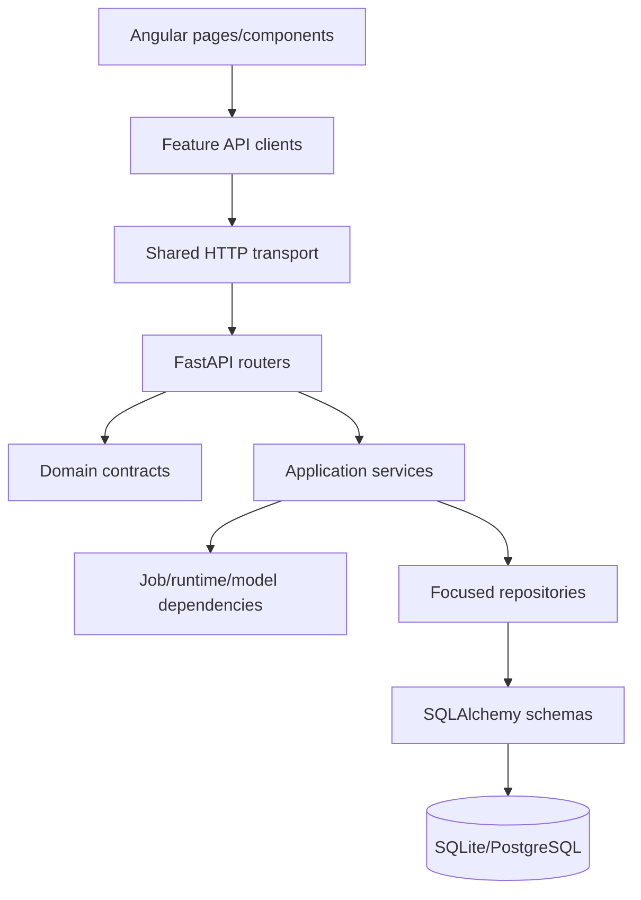

# XREPORT Architecture Review

Last updated: 2026-08-20

This review records the implementation status of the architecture findings identified during the XREPORT review on the `develop` branch. It is a decision and remediation record, not a second source of endpoint or schema truth; the specialized architecture documents remain authoritative for current behavior.

## Summary

No P0 blocker remains. The P1 findings were implemented and validated. The main P2 structural findings were also addressed: mutable job state is outside the domain package, service composition is explicit for preparation and inference, and the frontend API gateway is split by feature. Alembic now owns the long-lived database migration policy.

## Findings And Status

| Priority | Finding | Status | Implementation |
| --- | --- | --- | --- |
| P1 | Existing databases had no startup schema compatibility check. | Resolved | Alembic startup checks the current revision, adopts only an exact known v1 unversioned schema, applies pending revisions under a migration lock, and fails clearly on incompatible or unsupported schemas. |
| P1 | Generic `JobManager` contained inference-specific failure semantics. | Resolved | `JobManager` owns generic lifecycle state and fallback errors; feature services supply failure mapping when needed. |
| P1 | Inference history persistence failures could be swallowed after generation. | Resolved | `run_inference_job` raises a typed `persistence_failed` job error and leaves the job failed when history persistence fails. |
| P1 | `PreparationService` combined workflow coordination and dataset processing. | Resolved | `DatasetProcessingService` owns processing, splitting, tokenization, and processed-sample persistence behind an injected `DatasetRepository`. |
| P2 | Mutable `JobState` lived in the domain package. | Resolved | `JobState` and `JobExecutionError` now live in `services/jobs.py`; domain contains serializable job contracts only. |
| P2 | Service dependencies were partly hidden behind globals. | Resolved for reviewed composition paths | Preparation and inference factories compose job, repository, runtime, installation, and processing dependencies explicitly; job functions accept those dependencies as arguments. |
| P2 | One frontend `ApiService` crossed every backend feature. | Resolved | Shared transport is separated from inference, dataset, training, and validation API clients. Pages and components inject only the clients they use. |
| P2 | Architecture checks did not enforce the domain boundary strongly enough. | Resolved | The architecture test rejects domain imports of API, models, repositories, and services. |
| P3 | Documentation referenced a nonexistent Angular `hooks/*` layer. | Resolved | Architecture documentation now describes the actual services and polling boundaries. |

## Current Target Architecture

The architecture keeps contracts stable while allowing service and provider implementations to evolve behind injected boundaries. Persistence ownership remains singular: dataset, validation, and inference histories are written by their respective repositories.

## Migration Policy

### Alembic migration history

Alembic is now the schema authority. The baseline revision records the complete
known v1 schema, and the head revision removes the transitional
`schema_metadata` table. Startup and explicit initialization both upgrade to the
single head, with strict adoption for existing unversioned databases and
transaction/lock protection for concurrent processes.

### Broader service cleanup

Future service additions should preserve the explicit-composition rule. New jobs should use generic job errors plus feature-local mapping, and new persistence flows should surface repository failures rather than reporting successful completion.

## Validation Evidence

- Backend focused tests cover schema initialization, job failure semantics, cancellation, inference persistence failure, dataset processing, preparation scanning, and architecture imports.
- Angular lint, unit tests, and production build cover the feature-client split and existing frontend behavior.
- The implementation was committed in incremental slices and pushed to `origin/develop`.

## Related Documentation

- `system_overview.md`: runtime topology and dependency direction.
- `execution_and_data_flow.md`: service composition and job/data sequences.
- `persistence.md`: schema compatibility and entity ownership.
- `backend_api.md`: current FastAPI endpoint contract and serving behavior.
