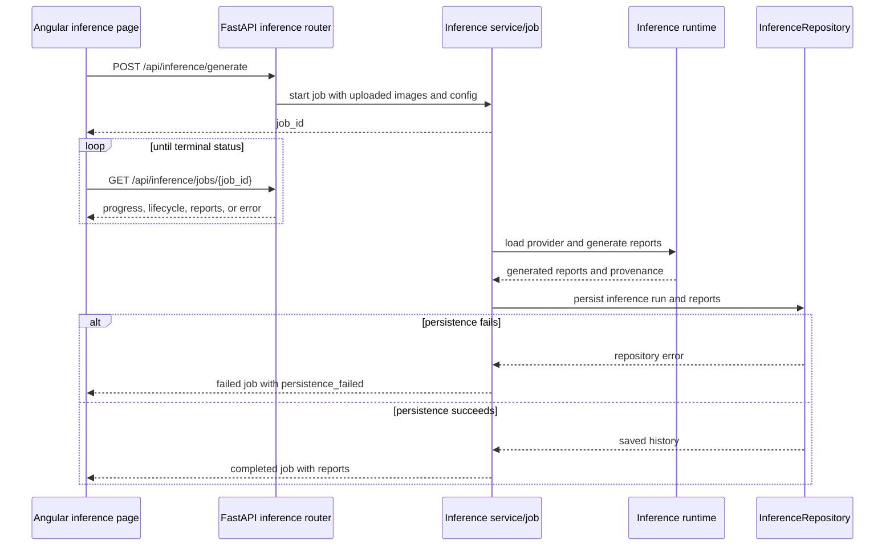
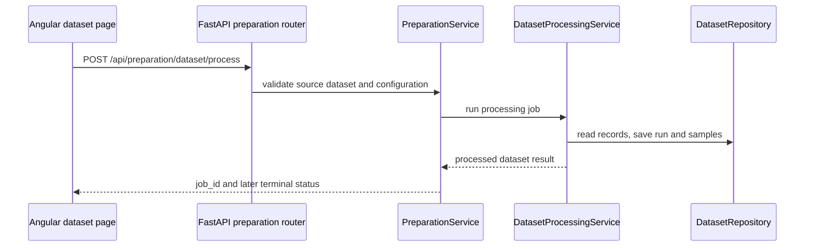

# XREPORT Execution And Data Flow

Last updated: 2026-08-20

## Layer Responsibilities

### Endpoint Layer

Location: `app/server/api`

- Parses multipart files plus path, query, and body parameters.
- Converts HTTP interactions into service calls.
- Applies response models and status codes.
- Maps typed service failures to the existing HTTP status and `{"detail": ...}` envelope through the registered exception handler.

### Domain Layer

Location: `app/server/domain`

- Defines transport-neutral request and response contracts for inference, jobs, training, and validation.
- Keeps endpoint contracts separate from service orchestration and provider implementations.
- Does not own mutable job state, exception taxonomy, repositories, or service imports.

### Service Layer

Location: `app/server/services`

- Contains orchestration and business rules.
- Starts and monitors long-running jobs.
- Maps repository results into API and domain responses.
- Owns training-process orchestration in `training_worker.py`, inference-catalog orchestration in `inference_catalog.py`, and dataset processing in `dataset_processing.py`.
- Raises typed `ServiceError` subclasses for expected request failures; the API layer performs HTTP translation.
- Uses `JobExecutionError` for runtime job failures. The generic job manager supplies generic fallback codes, while feature services provide a failure mapper when a workflow needs domain-specific classification.
- Loads serialized checkpoint artifacts before passing models and metadata to inference providers.
- Owns startup preparation through `startup_validation.py`, coordinating database compatibility checks and resource validation before the application serves requests.

### Repository Layer

Location: `app/server/repositories`

- `database/*`: backend engine creation and initialization.
- `schemas/*`: SQLAlchemy table definitions, constraints, indexes, and schema compatibility metadata.
- `serialization/dataset.py`: dataset, processing, and training-data persistence.
- `serialization/validation.py`: validation aggregates and checkpoint-evaluation persistence.
- `serialization/inference.py`: inference-run and generated-report persistence.
- `serialization/support.py`: shared database/session operations, entity lookup, and JSON/date normalization used by the independent repositories.

### Learning Layer

Location: `app/server/models`

- Holds preprocessing/tokenization, trainer, scheduler, dataloader, callback, and generator logic.
- Inference providers sit behind the catalog-selected `model_ref`. External models use the manifest-driven embedded Hugging Face Transformers runtime; custom XREPORT checkpoints retain their dedicated path.
- Model modules do not import services or repositories. Required artifacts and cancellation state are injected by services.

### Frontend Layer

Location: `app/client/src`

- `pages/*`: route-level workflows.
- `components/*`: reusable UI building blocks.
- `services/*-api.service.ts`: feature-specific backend integration.
- `services/api-request.service.ts`: shared transport and error formatting.
- `services/job-polling.service.ts`: shared start/poll/cancel support.

There is no `hooks/*` layer in the Angular application; the former documentation reference was stale.

## Explicit Service Composition

Factories compose runtime dependencies at the service boundary instead of hiding them behind imports:

- `get_preparation_service` creates one `DatasetRepository`, `JobManager`, and `DatasetProcessingService`, then injects them into `PreparationService`.
- `get_inference_service` composes the catalog, installation manager, inference runtime, repository, and job manager used by inference methods.
- Job functions accept the job manager and relevant repository/runtime dependencies explicitly, which keeps them testable without global service state.

## Generic Job Runtime

`app/server/services/jobs.py` owns mutable `JobState` and lifecycle transitions. The domain package exposes only the serializable job response contract. A job failure can carry a message, code, phase, and recoverability flag through `JobExecutionError`; the generic manager never interprets inference-specific exception classes. Feature services can provide a failure mapper, and unmapped failures use the generic `job_failed` / `execution` fallback.

All long-running endpoints follow the same external contract:

```text
start request -> job_id
                 |
                 +-> poll status/result
                 +-> cancel request when supported
```

## Inference Generation Flow



Inference history persistence failures are terminal job failures. They are logged and raised as typed job errors; they are not swallowed after a successful-looking generation result.

## Dataset Preparation Flow



Preparation owns workflow-level validation and naming. The processing service owns the compute-and-persist unit and receives its repository and job manager through composition.

## Async Versus Sync Behavior

- Most request handlers are synchronous at the transport boundary and delegate CPU-heavy or long-running work to background jobs through `threading.Thread` in the job manager.
- Async handlers are used where multipart or file I/O requires async behavior.
- Training uses the service-owned managed process worker pipeline.
- Preparation, validation, evaluation, training, and inference heavy tasks follow start, poll, and cancel flows.
- Database access is synchronous through SQLAlchemy engines and sessions. No async database driver is part of the current implementation.
- Uploaded image bytes are retained at the inference service boundary for the job lifetime and removed when the job completes, is cancelled, or fails to start.

## Architectural Constraints

- The system is local-first and filesystem-aware. Local path browsing is part of the supported workflow.
- No authentication or authorization layer is implemented in the current API surface.
- Job progress is polling-based. No production WebSocket API is exposed by backend routes.
- Feature clients must preserve the existing API envelopes and endpoint paths when splitting frontend integration.
