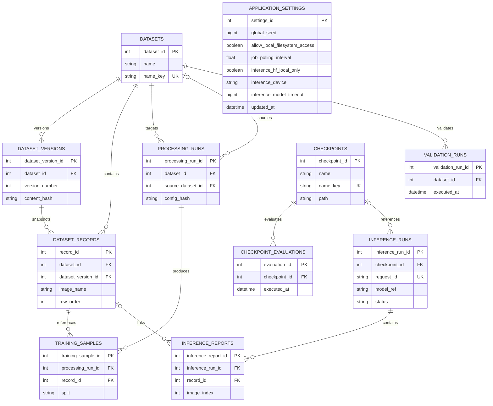

# XREPORT Persistence

Last updated: 2026-09-17

## Database Backend Selection

The sources of truth are deliberately separated:

- `settings/.env` owns deployment and infrastructure values such as the
  runtime host, ports, resource root, database mode, and database connection.
- The singleton `application_settings` database row owns mutable application
  behavior such as the global seed, filesystem-access flag, job polling
  interval, inference timeout, and hidden inference process policy.
- `app/server/configurations/inference_models.py` owns the immutable, reviewed
  inference catalogue and its safety/runtime contract.

From `settings/.env`:

- `XREPORT_RESOURCES_DIR` optionally changes the resource root. It defaults to `app/resources`; relative values are resolved from the repository root.
- `EMBEDDED_DATABASE=true`: SQLite using `<resource root>/database.db`.
- `EMBEDDED_DATABASE=false`: PostgreSQL using the configured engine, host, port, database name, user, password, and SSL settings.

## Initialization And Compatibility

Backend startup calls the startup service, which coordinates database preparation and resource validation before serving requests.

Alembic is the authoritative schema history. The checked-in migration stream has
one head (`f48a7c2e91b6`) and stores the applied revision in `alembic_version`.
The `f48a7c2e91b6` upgrade creates `application_settings` and, when upgrading
an installation that still has the legacy JSON file, imports its validated
values exactly once. The migration is the only compatibility reader; it does
not import environment values. After the upgrade commits, startup removes the
legacy file and never recreates or consults it.

### SQLite

- A missing database file is created by SQLAlchemy and upgraded from Alembic base to head.
- Startup acquires an exclusive SQLite transaction before checking or applying migrations, so concurrent processes serialize safely.
- A non-empty database without `alembic_version` is rejected. Existing data is
  never silently stamped, rewritten, or inferred as a compatible legacy schema;
  use the explicit migration/initialization workflow after reviewing the
  database state.
- The migration stream creates the singleton application-settings row, removes
  obsolete validation and checkpoint-evaluation job-state columns, then
  registers each complete checkpoint artifact found in the configured
  checkpoint directory exactly once. Name and normalized path collisions fail
  the migration.
- Partial, modified, or unexpected schemas fail without repair or stamping. Migration failures roll back the shared transaction.

### PostgreSQL

- Initialization and startup create the configured database through the administrative connection when it does not exist and the configured role has permission.
- Database creation and migration use bounded PostgreSQL advisory locks. Migrations run on one transaction-scoped connection and preserve existing data.
- A missing/unknown revision, multiple heads, incompatible legacy schema, unavailable database, or insufficient creation privilege fails startup with actionable sanitized logging.

`Base.metadata` is the target metadata used for reviewed autogeneration and drift checks. It is not used to create or evolve production schemas after Alembic is introduced.

If `settings/.env` is missing, it is copied from `settings/.env.example`; an existing environment file is never overwritten. Additional startup validation ensures required resource directories exist.

## Persisted Entity Model

The tables below are owned by independent repositories:

- `DatasetRepository`: datasets, dataset versions, records, processing runs, and training samples.
- `CheckpointRepository`: registered checkpoint identity, canonical artifact
  paths, artifact completeness, and safe deletion.
- `ValidationRepository`: validation runs and checkpoint evaluations.
- `InferenceRepository`: inference runs and generated reports.

Foreign-key behavior is explicit: dataset-owned records and processing data cascade with their dataset or processing run; a source dataset is set to null when removed; checkpoint references restrict deletion while history exists; inference reports cascade with their inference run and set their optional dataset record link to null when that record is removed.

## Constraints And Query Support

- Dataset and checkpoint names use normalized Unicode NFKC, trimmed, case-folded keys with unique constraints.
- Dataset versions enforce unique `(dataset_id, version_number)` and `(dataset_id, content_hash)` pairs, positive version numbers, and non-negative record counts.
- Training samples enforce unique `(processing_run_id, record_id)` pairs and a `train` or `validation` split.
- Inference history statuses are constrained to their supported lifecycle
  values. Job lifecycle state is owned by `JobManager`, not persisted as
  feature-specific report status columns.
- Inference history enforces unique request IDs and unique report image names and indexes.
- Dataset, processing, validation, checkpoint-evaluation, and report lookups have focused indexes defined in the schema models.

SQLite connections enable foreign-key enforcement, WAL journaling, normal synchronous mode, and a 30-second busy timeout. Dataframe persistence batches run inside one transaction and roll back together on failure.

## Non-Database Artifacts

Application settings are persisted transactionally in the singleton
`application_settings` row. `ApplicationSettingsRepository` validates the
complete typed model while applying partial updates, locks the row for update
on PostgreSQL, and commits only a valid result. Reads happen at operation
boundaries so the database remains authoritative across processes; long-running
jobs capture the relevant values at their start.

The four public values are returned by `GET /api/settings` and can be changed
with partial `PATCH /api/settings` or restored with
`POST /api/settings/reset`. The hidden `inference.hf_local_only` and
`inference.device` values remain in the row but are not exposed through those
routes. `inference.max_loaded_models` was unused and is not persisted.

The typed inference catalogue is immutable application code. It is not a
database preference, a user-editable setting, or a bundled JSON file.

- Checkpoint artifacts and model artifacts under `<resource root>/checkpoints`
  and `<resource root>/models`; checkpoint identity and history references stay
  in the database registry.
- Logs under `<resource root>/logs`.
- Templates under `<resource root>/templates`.
- Tokenizer resources under `<resource root>/tokenizers`.
