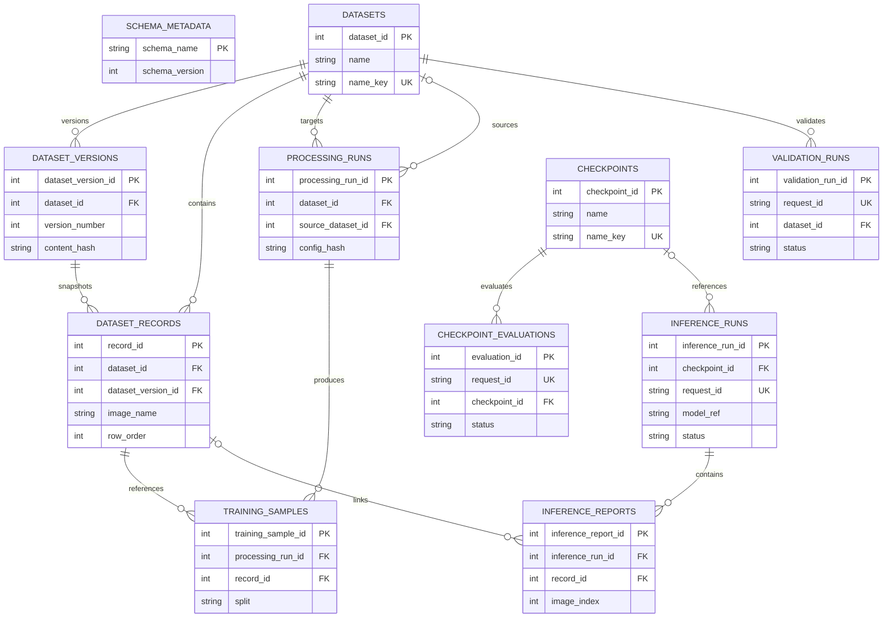

# XREPORT Persistence

Last updated: 2026-08-20

## Database Backend Selection

From `settings/.env`:

- `XREPORT_RESOURCES_DIR` optionally changes the resource root. It defaults to `app/resources`; relative values are resolved from the repository root.
- `EMBEDDED_DATABASE=true`: SQLite using `<resource root>/database.db`.
- `EMBEDDED_DATABASE=false`: PostgreSQL using the configured engine, host, port, database name, user, password, and SSL settings.

## Initialization And Compatibility

Backend startup calls the startup service, which coordinates database preparation and resource validation before serving requests.

The current application schema version is `1`, recorded in `schema_metadata` with `schema_name = 'xreport'`.

### SQLite

- A new database file is initialized with `Base.metadata.create_all` and stamped with the current schema version.
- An existing file is not recreated, reset, or reseeded. Startup inspects every required table and column.
- An existing structurally compatible database without the marker table receives the marker table and is stamped with the current version. This compatibility bootstrap does not attempt to transform arbitrary schema changes.
- A missing version marker, missing required table/column, or unsupported version raises `DatabaseSchemaError`. Startup stops with guidance to recreate the database or apply a supported migration before restarting.

### PostgreSQL

- Explicit database initialization creates the configured database when needed, ensures the current tables exist, and writes the schema marker.
- Startup performs a connection check and then verifies the existing schema and version marker. Startup does not silently create or migrate a PostgreSQL schema.

The repository currently uses SQLAlchemy metadata creation plus an explicit compatibility marker; it does not yet include an Alembic migration history. A future migration system must define supported upgrade paths before the schema version is advanced beyond the current compatibility check.

If `settings/.env` is missing, it is copied from `settings/.env.example`; an existing environment file is never overwritten. Additional startup validation ensures required resource directories exist.

## Persisted Entity Model

`schema_metadata` is an application compatibility marker and is intentionally not related to a business entity. The other tables are owned by independent repositories:

- `DatasetRepository`: datasets, dataset versions, records, processing runs, and training samples.
- `ValidationRepository`: validation runs and checkpoint evaluations.
- `InferenceRepository`: inference runs and generated reports.

Foreign-key behavior is explicit: dataset-owned records and processing data cascade with their dataset or processing run; a source dataset is set to null when removed; checkpoint references restrict deletion while history exists; inference reports cascade with their inference run and set their optional dataset record link to null when that record is removed.

## Constraints And Query Support

- Dataset and checkpoint names use normalized Unicode NFKC, trimmed, case-folded keys with unique constraints.
- Dataset versions enforce unique `(dataset_id, version_number)` and `(dataset_id, content_hash)` pairs, positive version numbers, and non-negative record counts.
- Training samples enforce unique `(processing_run_id, record_id)` pairs and a `train` or `validation` split.
- Validation, checkpoint-evaluation, and inference statuses are constrained to their supported lifecycle values.
- Inference history enforces unique request IDs and unique report image names and indexes.
- Dataset, processing, validation, checkpoint-evaluation, and report lookups have focused indexes defined in the schema models.

SQLite connections enable foreign-key enforcement, WAL journaling, normal synchronous mode, and a 30-second busy timeout. Dataframe persistence batches run inside one transaction and roll back together on failure.

## Non-Database Artifacts

- Checkpoints and model artifacts under `<resource root>/checkpoints` and `<resource root>/models`.
- Logs under `<resource root>/logs`.
- Templates under `<resource root>/templates`.
- Tokenizer resources under `<resource root>/tokenizers`.
