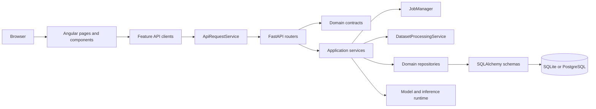

# XREPORT System Overview

Last updated: 2026-08-30

XREPORT is a local-first client/server system for radiological report generation, dataset preparation, training, validation, and model lifecycle workflows.

## Runtime Topology

- Frontend: standalone Angular 22 + TypeScript in `app/client`.
- Backend: FastAPI in `app/server`.
- API contracts: transport-neutral Pydantic models in `app/server/domain`,
  mirrored in the checked-in `app/shared/openapi.json` and generated Angular
  types.
- Backend orchestration: services in `app/server/services`.
- Persistence: SQLAlchemy repositories and schemas in `app/server/repositories`, with SQLite by default and PostgreSQL optional.
- Learning runtime: model, provider, and inference implementation details in `app/server/models`.
- Long-running execution: start, poll, and cancel jobs through the generic
  `app/server/services/jobs.py` lifecycle and `/api/jobs` resource.
- Startup validation: Alembic database creation/upgrade and required resource-directory checks before the API serves requests.

The Angular application and FastAPI application are separate runtimes. The Windows launcher starts them as coordinated local processes; the backend root redirects to FastAPI documentation, while the Angular runtime owns the user interface.

### Packaged Windows topology

The packaged topology is a native Tauri shell -> verified local runtime ->
windowless frozen FastAPI process -> Angular static files. Rust owns runtime
extraction, the common per-user mutex, dynamic-port readiness/health polling,
the Windows Job Object, navigation policy, and shutdown. FastAPI owns the API,
SPA fallback, cookie bootstrap, and same-origin security headers. Immutable
runtime files are separated from mutable `%LOCALAPPDATA%\XREPORT\data`.

The source topology remains FastAPI on 5003 plus Angular preview on 8003.
`LaunchDesktopDev` exercises it through a debug Tauri window; `Launch` keeps
the normal browser workflow.

## Dependency Direction



The intended dependency rule is inward and explicit: transport adapts requests to contracts, services orchestrate use cases, repositories own persistence, and learning modules own model execution. Domain contracts do not import services, repositories, API routers, or mutable job runtime state.

## Implementation-Relevant Repository Structure

```text
.
├─ README.md
├─ start_on_windows.ps1
├─ runtimes/
│  ├─ python/
│  ├─ uv/
│  └─ nodejs/
├─ assets/
│  └─ docs/
├─ settings/
│  ├─ .env.example
│  └─ configurations.json
└─ app/
   ├─ resources/
   ├─ scripts/
   │  └─ initialize_database.py
   ├─ server/
   │  ├─ pyproject.toml
   │  ├─ api/
   │  ├─ common/
   │  ├─ domain/
   │  ├─ configurations/
   │  ├─ models/
   │  ├─ services/
   │  └─ repositories/
   ├─ client/
   │  ├─ package.json
   │  ├─ angular.json
   │  └─ src/
   └─ tests/
      └─ run_tests.bat
```

## Backend Boundaries

### API and domain

`app/server/api` owns HTTP parsing, router registration, response models, and service-error-to-HTTP translation. `app/server/domain` contains stable request and response contracts only. `JobState` and `JobExecutionError` are service-runtime concerns, not domain contracts.

### Services

`app/server/services` contains use-case orchestration and explicit dependency composition. `DatasetProcessingService` owns tokenization, split calculation, processed-row persistence, and processing metadata. `PreparationService` owns preparation workflow state and delegates processing. `InferenceService` receives its runtime, installation, repository, and job dependencies through its factory.

### Repositories and learning runtime

`app/server/repositories` contains SQLAlchemy schemas plus focused dataset,
checkpoint, validation, and inference persistence boundaries. Checkpoint
identity is database-owned; the filesystem stores only the registered model
artifacts. `app/server/models` contains model-training and inference
implementation details; it is not the ORM model layer. ORM metadata lives in
`repositories/schemas`; Alembic revisions and the migration environment live in
`server/migrations`.

## Frontend Boundaries

Route pages and reusable components inject feature-specific clients:

- `services/inference-api.service.ts`: model catalogue, maintenance, and generation.
- `services/dataset-api.service.ts`: upload, loading, browsing, processing, and image inspection.
- `services/training-api.service.ts`: checkpoints and training.
- `services/validation-api.service.ts`: dataset validation and checkpoint evaluation.
- `services/jobs-api.service.ts`: generic job listing, status, and cancellation.
- `services/api-request.service.ts`: shared HTTP execution and error-envelope formatting.
- `services/job-polling.service.ts`: shared polling behavior over the generic job client.

This keeps page dependencies aligned with the feature they operate on and avoids a single cross-domain API gateway.

## Entry Points

- Backend API entrypoint: `app/server/app.py`.
- Frontend web entrypoint: `app/client/src/main.ts`.
- Frontend route composition: `app/client/src/app/app.routes.ts`.
- OpenAPI source snapshot and generated client types: `app/shared/openapi.json` and `app/client/src/app/types/api.generated.ts`.
- Release version authority: `app/server/pyproject.toml`; client, desktop,
  Tauri, backend metadata, and OpenAPI copies are validated against it.
- Local launcher and maintenance menu on Windows: `start_on_windows.ps1`.
- Explicit database initialization: `app/scripts/initialize_database.py` and launcher option 4.
